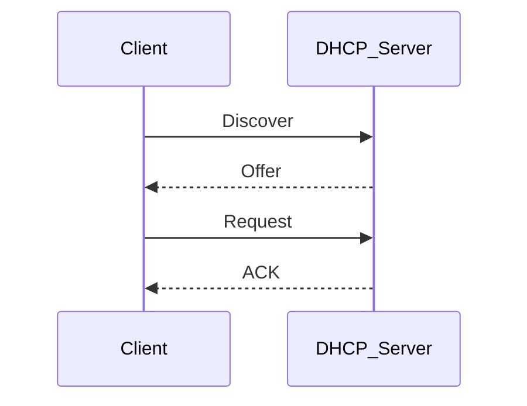
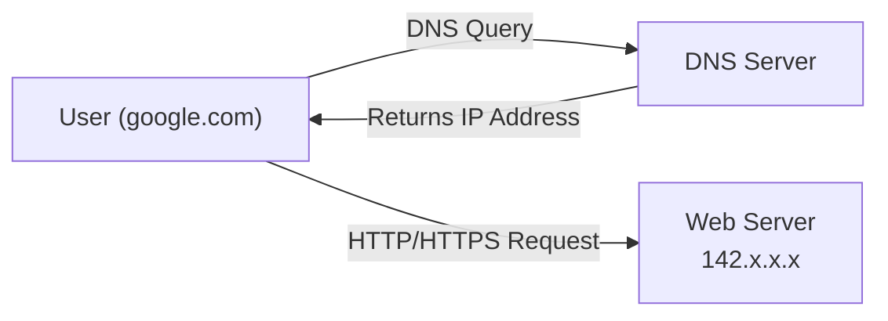

# Port number (2^16)
 > used to identify specific application or services on a device
 
 ---
## Well-Known Ports (0-1023)
> reserved for standardized network services and core operating system processes

---

## Registered Ports (1024–49151)
> assigned by IANA to specific vendor application and user services

---
## Dynamic/Private Ports (49152–65535)
> temporarily assigned for client connections

---
# Email Protocols    
  
| Protocol | Purpose                     | Default Port |
| -------- | --------------------------- | -----------: |
| SMTP     | Send email                  |           25 |
| POP3     | Receive (Download) email    |          110 |
| IMAP     | Receive (Synchronize) email |          143 |
  
> **Remember:**  
> - **SMTP = Send**  
> - **POP3 = Pull (Download)**  
> - **IMAP = Sync**  
  
---  
  
## SMTP (Simple Mail Transfer Protocol)  
  
### Default Port  
  
- **25/TCP** → Mail Server to Mail Server communication  
- **587/TCP** → Mail Client Submission (Recommended)  
- **465/TCP** → SMTPS (Legacy SSL)  
  
> SMTP is used to **send email** only.  
  
---  
  
### Purpose  
  
SMTP is responsible for:  
  
- Sending email from a client to a mail server.  
- Sending email between mail servers.  
- Relaying email across the Internet.  
  
SMTP **does not retrieve emails**.   
  
---  
  
### SMTP Commands  
  
| Command   | Description                                   |
| --------- | --------------------------------------------- |
| HELO      | Introduces the client                         |
| EHLO      | Extended HELO (supports modern SMTP features) |
| MAIL FROM | Specifies the sender                          |
| RCPT TO   | Specifies the recipient                       |
| DATA      | Begins the email message                      |
| QUIT      | Ends the session                              |

  
---  
  
## POP3 (Post Office Protocol v3)  
  
### Default Ports  
  
- **110/TCP** → POP3  
- **995/TCP** → POP3 over SSL/TLS  
  
### Purpose  
  
POP3 downloads emails from the mail server to the local computer.  
  
After downloading, emails are usually removed from the server.  
  
Best for:  
  
- One device  
- Offline access  
  
---  
  
## IMAP (Internet Message Access Protocol)  
  
### Default Ports  
  
- **143/TCP** → IMAP  
- **993/TCP** → IMAPS (SSL/TLS)  
  
### Purpose  
  
IMAP synchronizes emails between the mail server and multiple devices.  
  
Emails remain stored on the server.  
  
Best for:  
  
- Multiple devices  
- Phones + Laptops  
- Tablets  
- Webmail  
  
---  
  
## SMTP vs POP3 vs IMAP  
  
| Feature | SMTP | POP3 | IMAP |  
|---------|------|------|------|  
| Send Email | ✅ | ❌ | ❌ |  
| Receive Email | ❌ | ✅ | ✅ |  
| Synchronization | ❌ | ❌ | ✅ |  
| Keeps Mail on Server | N/A | Usually No | Yes |  
| Multiple Devices | ❌ | Limited | Excellent |  
  
---  
  
## Common Mail Server Applications  
  
- Microsoft Exchange Server  
- Lotus Domino (IBM/HCL Domino)  
- Postfix  
- Sendmail  
  
--- 
## Mail Client Applications  
  
Common email clients include:  
  
- Microsoft Outlook  
- Mozilla Thunderbird  
- Apple Mail  
- Windows Mail  
- Gmail (Web)  
- Outlook Web App (OWA)  

---

# FTP (File Transfer Protocol)
  > Used to transfer files between client and server over a network

  ---
## Default Ports 
  - **21/TCP** → Control connection (commands)
  - **20/TCP** → Data connection
---
## FTP allows users to:  
- Upload files to a server  
- Download files from a server
---

# Telnet  

Purpose : Remote Login (CLI)  
Port : 23/TCP  
Security:  Plain Text  

---
# SSH  
  
Purpose : Secure Remote Login (CLI)  
Port : 22/TCP  
Security:  Encrypted  

---
# RDP    
Purpose : Remote Desktop (GUI)  
Port : 3389/TCP  
Security: Encrypted

---

# DHCP (Dynamic Host Configuration Protocol)

> Automatically assigns IP configuration to devices on a network.

---

## Default Ports

- **67/UDP** → DHCP Server
- **68/UDP** → DHCP Client

---

## Purpose

DHCP automatically provides:

- IP Address
- Subnet Mask
- Default Gateway
- DNS Server
- Lease Time

Without DHCP, these settings must be configured manually.

---

## DHCP Process (DORA)




1. **Discover** → Client broadcasts for a DHCP server.
2. **Offer** → Server offers an IP address.
3. **Request** → Client requests the offered IP.
4. **Acknowledge (ACK)** → Server confirms the lease.


---

# DNS (Domain Name System)

> Translates domain names into IP addresses.




---

## Default Ports

- **53/UDP** → Name queries
- **53/TCP** → Zone transfers & large responses

---

## Purpose

Instead of remembering:

```
142.250.190.78
```

Users type:

```
google.com
```

DNS resolves the name into an IP address.


---

# P2P (Peer-to-Peer)

> A network model where each computer can act as both a client and a server.


---

## Characteristics

- No dedicated server
- Easy to set up
- Low cost
- Suitable for small networks


---

# SMB (Server Message Block)

> Used to share files, folders, and printers on Windows networks.

---

## Default Port

- **445/TCP**

*(Older SMB versions also used NetBIOS ports 137–139.)*

---

## Purpose

Allows users to:

- Share files
- Share folders
- Share printers
- Access network drives

---

## Features

- File sharing
- Printer sharing
- Authentication
- Active Directory integration
- Windows-native protocol

---

# NFS (Network File System)

> Used to share files and directories between Linux/Unix systems.

---

## Default Port

- **2049/TCP**

---

## Purpose

Allows clients to access remote files as if they were stored locally.

---

## Features

- File sharing
- Directory sharing
- Centralized storage
- Common in Linux/Unix environments

---

# Cheat Sheet  
  
## Port Ranges  
  
| Range | Name | Purpose |  
|-------:|------|---------|  
| 0–1023 | Well-Known | Standard services |  
| 1024–49151 | Registered | Vendor applications |  
| 49152–65535 | Dynamic/Private | Temporary client ports |  
  
---  
  
## Common Protocols  
  
| Protocol | Port | Transport | Purpose |  
|----------|-----:|-----------|---------|  
| HTTP | 80 | TCP | Web Browsing |  
| HTTPS | 443 | TCP | Secure Web Browsing |  
| FTP | 20/21 | TCP | File Transfer |  
| SMTP | 25 | TCP | Send Email |  
| SMTP Submission | 587 | TCP | Mail Client Submission |  
| SMTPS | 465 | TCP | Secure SMTP |  
| POP3 | 110 | TCP | Download Email |  
| POP3S | 995 | TCP | Secure POP3 |  
| IMAP | 143 | TCP | Synchronize Email |  
| IMAPS | 993 | TCP | Secure IMAP |  
| Telnet | 23 | TCP | Remote CLI |  
| SSH | 22 | TCP | Secure Remote CLI |  
| RDP | 3389 | TCP | Remote Desktop |  
| DNS | 53 | TCP/UDP | Name Resolution |  
| DHCP Server | 67 | UDP | Assign IP Addresses |  
| DHCP Client | 68 | UDP | Receive IP Configuration |  
| SMB | 445 | TCP | Windows File Sharing |  
| NFS | 2049 | TCP | Linux File Sharing |  
  
---  
  
## Remember  
  
 **Email**  
- SMTP → Send  
- POP3 → Pull (Download)  
- IMAP → Sync  
  
 **File Sharing**  
- FTP → File Transfer  
- SMB → Windows Sharing  
- NFS → Linux Sharing  
  
 **Remote Access**  
- Telnet → CLI (Not Secure)  
- SSH → CLI (Encrypted)  
- RDP → GUI (Windows)  
  
 **Network Services**  
- DNS → Name → IP  
- DHCP → Automatic IP Configuration


