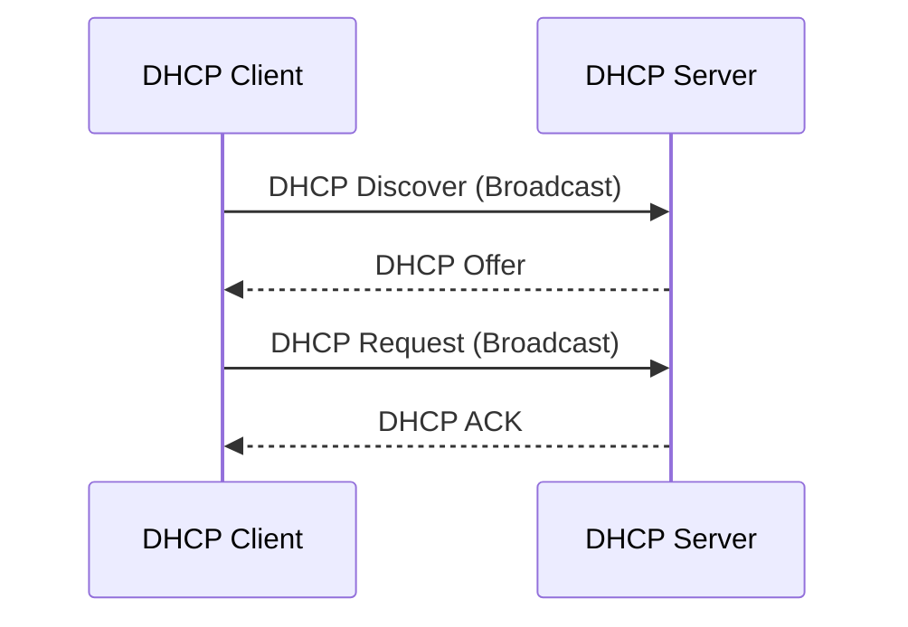

# DHCP

> **DHCP (Dynamic Host Configuration Protocol)** automatically assigns IP configuration (IP address, Subnet Mask, Default Gateway, DNS Server, etc.) to clients.

## DHCP DORA Process



### DORA

| Step | Description |
|------|-------------|
| **D** - Discover | Client broadcasts to find available DHCP servers. |
| **O** - Offer | DHCP server offers an available IP address and configuration. |
| **R** - Request | Client requests to use the offered IP address. |
| **A** - ACK (Acknowledge) | Server confirms the lease and assigns the IP configuration. |

### Process Flow

```text
Client
   │
   ├── DHCP Discover (Broadcast)
   ▼
DHCP Server
   │
   ├── DHCP Offer
   ▼
Client
   │
   ├── DHCP Request (Broadcast)
   ▼
DHCP Server
   │
   └── DHCP ACK
   ▼
Client receives:
• IP Address
• Subnet Mask
• Default Gateway
• DNS Server
• Lease Time
```

---
# Install DHCP Server

![[MCSA/DHCP/Pasted image 20260806134925.png]]

---
# Configure DHCP Server

![[MCSA/DHCP/Pasted image 20260806140111.png]]
![[MCSA/DHCP/Pasted image 20260806140233.png]]
![[MCSA/DHCP/Pasted image 20260806140500.png]]
![[MCSA/DHCP/Pasted image 20260806140523.png]]
![[MCSA/DHCP/Pasted image 20260806140637.png]]
![[MCSA/DHCP/Pasted image 20260806141035.png]]
![[MCSA/DHCP/Pasted image 20260806141405.png]]
![[MCSA/DHCP/Pasted image 20260806142023.png]]
![[MCSA/DHCP/Pasted image 20260806142048.png]]
![[MCSA/DHCP/Pasted image 20260806142104.png]]
![[MCSA/DHCP/Pasted image 20260806142121.png]]
![[MCSA/DHCP/Pasted image 20260806142457.png]]
