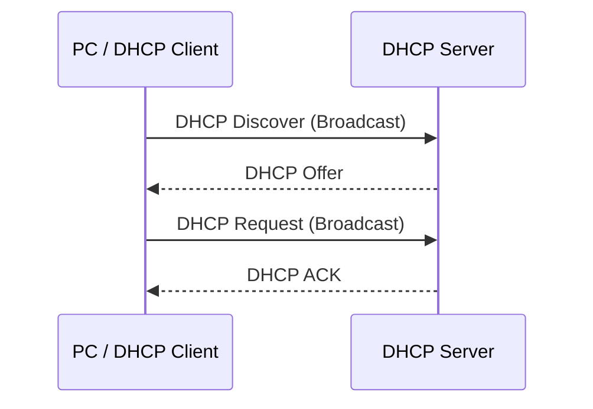

---
tags:
  - MCSA
  - NETWORK
  - DHCP
---

# DHCP

## DHCP DORA Process

- DHCP is used to automatically give clients:
    
    - IP address
        
    - Subnet mask
        
    - Default Gateway
        
    - DNS server
        
    - Lease time
        

### DORA



- **D → Discover**
    
    - PC broadcasts to find a DHCP Server
        
- **O → Offer**
    
    - DHCP Server offers an IP address to the PC
        
- **R → Request**
    
    - PC requests the offered IP
        
- **A → ACK**
    
    - DHCP Server confirms the IP lease
        

> **DORA = Discover → Offer → Request → ACK**

- If more than one DHCP Server sends an offer:
    
    - PC normally accepts the **first suitable offer**
        

---

## DHCP Lease

- PC gets the IP address for a specific amount of time
    
- This is called the **Lease Time**
    
- Windows Server default DHCP lease time → **8 days**
    

### Lease Renewal

- **50% of lease → T1**
    
    - PC tries to renew the lease with **original DHCP Server**
        
- **87.5% of lease → T2**
    
    - If the original DHCP Server cannot be reached:
        
    - PC starts **rebinding**
        
    - PC broadcasts to find **any available DHCP Server**
        
- **100% of lease**
    
    - Lease expires
        
    - PC can no longer use the IP

	- PC use APIPA
        

### Example — 8 Day Lease

```text
Lease starts
     ↓
50% = 4 days
     ↓
Try to renew with original DHCP Server
     ↓
87.5% = 7 days
     ↓
Broadcast to find any DHCP Server
     ↓
100% = 8 days
     ↓
Lease expires
```

> **Remember:**  
> **50% → Renew**  
> **87.5% → Rebind**  
> **100% → Expire**

---

# APIPA

- If a Windows PC cannot get an IP from DHCP:
    
    - Windows can automatically assign an **APIPA** address
        
- APIPA range:
    

```text
169.254.0.0/16
```

- Example:
    

```text
169.254.20.15
```

- APIPA is:
    
    - **Not normally routable**
        
    - Mainly useful for communication on the local network
        
    - Not suitable for normal communication between different networks
        

### If PC Gets `169.254.x.x`

Check:

- DHCP Server is running
    
- Network connection is working
    
- DHCP scope is configured correctly
    
- DHCP Server is authorized
    
- VLAN configuration
    
- DHCP Relay, if the client and server are on different networks
    
- Firewall/network configuration
    

---

# Install DHCP

## Before Installing DHCP

- DHCP Server should have a **static IP**
    
- Example:
    

```text
Gateway:     192.168.100.1
DHCP Server: 192.168.100.100
```

---

# (01) Install DHCP Role

![[MCSA/DHCP/Pasted image 20260830193313.png]]

![[MCSA/DHCP/Pasted image 20260830193348.png]]

---

# (02) Configure DHCP Server

![[MCSA/DHCP/Pasted image 20260830203814.png]]

![[MCSA/DHCP/Pasted image 20260830203918.png]]

![[MCSA/DHCP/Pasted image 20260830204050.png]]

![[MCSA/DHCP/Pasted image 20260830204235.png]]

![[MCSA/DHCP/Pasted image 20260830213415.png]]

---

## Network Configuration

- **Gateway**
    

```text
192.168.100.1
```

- **DHCP Server**
    

```text
192.168.100.100
```

- **Static IP range**
    

```text
192.168.100.2
      ↓
192.168.100.20
```

- Static IPs can be used for devices such as:
    
    - Printers
        
    - Servers
        
    - Network devices
        
- These static IPs should be **excluded from the DHCP scope**
    

### Example

```text
192.168.100.1        → Gateway
192.168.100.2-20     → Static IPs
192.168.100.100      → DHCP Server
192.168.100.21-99    → DHCP Clients
192.168.100.101-254  → DHCP Clients
```

> The exact DHCP range depends on your network design.

---

## DHCP Scope

- DHCP Scope = range of IP addresses DHCP can give to clients
    

Example:

```text
Network:
192.168.100.0/24

DHCP Range:
192.168.100.21
        ↓
192.168.100.254
```

- Scope can contain:
    
    - IP address range
        
    - Exclusion range
        
    - Lease duration
        
    - Default Gateway
        
    - DNS Server
        
    - Reservations
        
    - Other DHCP options
        

![[MCSA/DHCP/Pasted image 20260830213712.png]]

  

![[MCSA/DHCP/Pasted image 20260830213843.png]]

  

![[MCSA/DHCP/Pasted image 20260830213939.png]]

  

![[MCSA/DHCP/Pasted image 20260830214003.png]]

  

![[MCSA/DHCP/Pasted image 20260830214044.png]]

  

![[MCSA/DHCP/Pasted image 20260830214107.png]]


---

# (03) Configure DHCP Client

- On the Windows client:
    
    - Press:
        

```text
Windows + R
```

- Type:
    

```text
ncpa.cpl
```

- Press **Enter**


![[MCSA/DHCP/Pasted image 20260831180332.png]]

![[MCSA/DHCP/Pasted image 20260831180446.png]]

![[MCSA/DHCP/Pasted image 20260831181744.png]]

![[MCSA/DHCP/Pasted image 20260831181832.png]]

![[MCSA/DHCP/Pasted image 20260831182010.png]]

---
# Check the DHCP Client

- Open CMD
    

```cmd
ipconfig
```

- Or:
    

```cmd
ipconfig /all
```

- Check:
    

```text
IPv4 Address
Subnet Mask
Default Gateway
DHCP Server
```

### Force the PC to Get a New IP

```cmd
ipconfig /release
ipconfig /renew
```

- `ipconfig /release`
    
    - Releases the current DHCP address
        
- `ipconfig /renew`
    
    - Requests a new DHCP lease
        

---

# Check DHCP Address Leases

- On the DHCP Server:
    
    - Open **Server Manager**
        
    - Go to **Tools**
        
    - Open **DHCP**
        
- Navigate to:
    

```text
IPv4
  ↓
Your Scope
  ↓
Address Leases
```

- **Address Leases** shows the IP addresses currently leased to clients
    
![[MCSA/DHCP/Pasted image 20260831182050.png]]

---

# Quick Revision

## DORA

```text
D → Discover
O → Offer
R → Request
A → ACK
```

## Lease

```text
50%   → T1 → Renew with original DHCP Server
87.5% → T2 → Rebind using broadcast
100%  → Lease expires
```

## APIPA

```text
169.254.0.0/16
```

## Important

- DHCP Server → **Static IP**
    
- DHCP Client → **Automatic IP**
    
- DHCP Scope → **Range of IPs DHCP can assign**
    
- Exclusion → **IPs DHCP must not assign**
    
- Address Leases → **Clients currently receiving DHCP leases**
    
- `ipconfig /renew` → **Request a DHCP lease**
    
- `ipconfig /release` → **Release the DHCP lease**
    

## Lab Network

```text
Gateway:       192.168.100.1
DHCP Server:   192.168.100.100

Static:
192.168.100.2 – 192.168.100.20

DHCP:
192.168.100.21 – 192.168.100.254
```

> **MCSA Memory Points**
> 
> - **DORA** → Get an IP
>     
> - **50%** → Renew
>     
> - **87.5%** → Rebind
>     
> - **100%** → Expire
>     
> - **169.254.x.x** → APIPA
>     
> - **DHCP Server** → Static IP
>     
> - **DHCP Client** → Automatic IP
>
