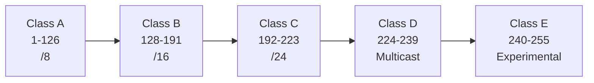

# IPv4 Address Classes

IPv4 addresses are **32 bits** long and are divided into **5 classes (A–E)**.




---

## Class A (0)

**First Bit:** `0`

**Range:**
```
1.0.0.0 → 126.255.255.255
```

**Default Subnet Mask**
```
255.0.0.0
```

**Prefix**
```
/8
```

**Network / Host**
```
N.H.H.H
```

- Very large networks
- Up to **126 Networks**
- **16,777,214 Hosts per Network**

---

## Class B (10)

**First Bits:** `10`

**Range:**
```
128.0.0.0 → 191.255.255.255
```

**Default Subnet Mask**
```
255.255.0.0
```

**Prefix**
```
/16
```

**Network / Host**
```
N.N.H.H
```

- Medium-sized networks
- **16,384 Networks**
- **65,534 Hosts per Network**

---

## Class C (110)

**First Bits:** `110`

**Range:**
```
192.0.0.0 → 223.255.255.255
```

**Default Subnet Mask**
```
255.255.255.0
```

**Prefix**
```
/24
```

**Network / Host**
```
N.N.N.H
```

- Small networks
- **2,097,152 Networks**
- **254 Hosts per Network**

---

## Class D (1110)

**First Bits:** `1110`

**Range:**
```
224.0.0.0 → 239.255.255.255
```

**Purpose**
- Multicast
- No subnet mask
- Not assigned to hosts

Examples:
- Video Streaming
- IPTV
- Routing Protocols

---

## Class E (1111)

**First Bits:** `1111`

**Range:**
```
240.0.0.0 → 255.255.255.254
```

**Purpose**
- Experimental
- Research
- Reserved

Not used for normal hosts.

---
# Quick Identification

| First Octet | Class |
|-------------|--------|
| 1–126 | A |
| 128–191 | B |
| 192–223 | C |
| 224–239 | D |
| 240–255 | E |

> **Note:**
> - **127.x.x.x** = Loopback (Reserved)
> - **0.x.x.x** = "This Network" (Reserved)

---

# Memory Tricks

```
A = Any (Large Networks)
/8

B = Bigger Networks
/16

C = Common LAN
/24

D = Distribution (Multicast)

E = Experimental
```
