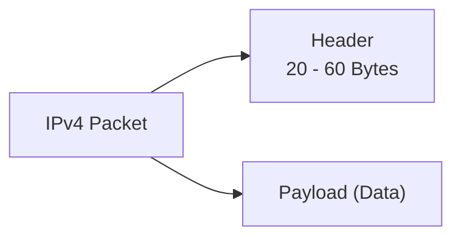
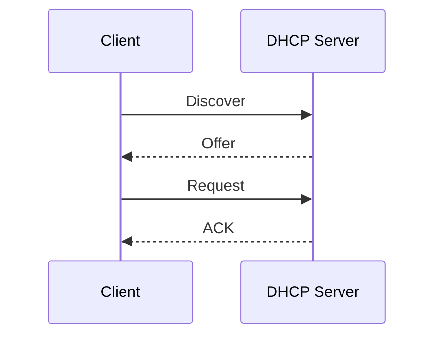

# IPv4 (Internet Protocol Version 4)

> IPv4 is a **Layer 3 (Network Layer)** protocol responsible for **logical addressing** and **routing packets** between different networks.

---

# IPv4 Characteristics

| Feature           | Description                            |
| ----------------- | -------------------------------------- |
| Layer             | Network Layer (Layer 3)                |
| Address Length    | 32 Bits                                |
| Address Format    | Four 8-bit octets                      |
| Header Size       | 20 Bytes (Minimum), 60 Bytes (Maximum) |
| Maximum Addresses | 2³² ≈ 4.29 Billion                     |

Example

```
192.168.1.10
```

Binary

```
11000000.10101000.00000001.00001010
```

---

# IPv4 Packet Structure

An IPv4 packet consists of two parts:


```mermaid
flowchart LR

A["IPv4 Packet"]

A --> B["Header<br>20 - 60 Bytes"]

A --> C["Payload (Data)"]
```

- **Header** contains routing and control information.
- **Payload** contains the transported data (TCP, UDP, ICMP, etc.).

---

# IPv4 Header


![[IPv4-Header-1.webp]]

---

# IPv4 Header Fields

## Version

Specifies the IP version.

```
IPv4 = 4
IPv6 = 6
```

---

## IHL (Internet Header Length)

Indicates the size of the IPv4 header.

- Minimum: 20 Bytes
- Maximum: 60 Bytes

---

## DSCP (Differentiated Services Code Point)

Used for **Quality of Service (QoS)**.

Allows important traffic (Voice, Video) to receive higher priority.

---

## ECN (Explicit Congestion Notification)

Indicates network congestion without dropping packets.

Used together with TCP congestion control.

---

## Total Length

Represents the total packet size.

Includes:

- Header
- Payload

Maximum size:

```
65,535 Bytes
```

---

## Identification

A unique number assigned to a packet.

Used when packet fragmentation occurs so the receiver can reassemble all fragments correctly.

---

## Flags

Controls fragmentation.

Three bits are available:

| Flag | Meaning |
|------|---------|
| Reserved | Always 0 |
| DF (Don't Fragment) | Prevents fragmentation |
| MF (More Fragments) | Indicates more fragments follow |

---

## Fragment Offset

Specifies the position of a fragment within the original packet.

Used to correctly reassemble fragmented packets.

---

## TTL (Time To Live)

Prevents packets from looping forever.

Each router decreases TTL by **1**.

When TTL reaches **0**, the router discards the packet.

Example:

```
TTL = 64

↓

Router 1 = 63

↓

Router 2 = 62

↓

...

↓

TTL = 0

Packet Dropped
```

---

## Protocol

Identifies the protocol encapsulated inside the IPv4 packet.

| Protocol | Number |
|----------|-------:|
| ICMP | 1 |
| TCP | 6 |
| UDP | 17 |
| OSPF | 89 |

---

## Header Checksum

Detects errors in the IPv4 header.

If incorrect:

- Packet is discarded.

Only checks the **Header**, not the Data.

---

## Source Address

IPv4 address of the sender.

Example

```
192.168.1.10
```

---

## Destination Address

IPv4 address of the receiver.

Example

```
8.8.8.8
```

---

## Options

Optional information.

Rarely used because it increases header size.

Examples:

- Timestamp
- Security
- Route Recording

---

# IPv4 Address Assignment Methods

There are three common methods for assigning an IPv4 address.

---

## Static Addressing

The administrator manually configures the network settings.

Required information:

- IP Address
- Subnet Mask
- Default Gateway
- Preferred DNS Server
- Alternate DNS Server (Optional)

Example

```
IP Address      : 192.168.1.10
Subnet Mask     : 255.255.255.0
Default Gateway : 192.168.1.1
DNS Server      : 8.8.8.8
```

Advantages

- Address never changes
- Best for servers
- Easy to locate devices
- Supports services such as DNS, DHCP, and Web Servers

Disadvantages

- Time-consuming
- Manual configuration
- Human errors may cause duplicate IP addresses

Common Uses

- Servers
- Printers
- Routers
- Switch Management Interfaces

---

## Dynamic Addressing (DHCP)

A DHCP server automatically assigns network configuration.

The client receives:

- IP Address
- Subnet Mask
- Default Gateway
- DNS Server
- Lease Time

Process (DORA)


```mermaid
sequenceDiagram
Client->>DHCP Server: Discover
DHCP Server-->>Client: Offer
Client->>DHCP Server: Request
DHCP Server-->>Client: ACK
```

Advantages

- Automatic configuration
- Prevents duplicate addresses
- Easy administration
- Suitable for large networks

Disadvantages

- Requires a DHCP Server
- If DHCP is unavailable, clients cannot receive new addresses

Common Uses

- Home Networks
- Offices
- Schools
- Enterprise Networks

---

## APIPA (Automatic Private IP Addressing)

If a Windows computer cannot contact a DHCP server, it automatically assigns itself an IP address.

Range

```
169.254.0.0/16
```

Example

```
169.254.25.100
```

Characteristics

- Automatic
- No DHCP required
- Local communication only
- No Internet access
- Indicates DHCP failure

---

# Loopback Address

```
127.0.0.1
```

Purpose

- Tests the TCP/IP stack.
- Tests local network services.
- Also called **localhost**.

Example

```
ping 127.0.0.1
```

If successful, the TCP/IP stack is functioning correctly.

---

# Special IPv4 Addresses

| Address | Purpose |
|---------|---------|
| 0.0.0.0 | This Network / Default Route |
| 127.0.0.1 | Loopback |
| 169.254.0.0/16 | APIPA |
| 255.255.255.255 | Limited Broadcast |
