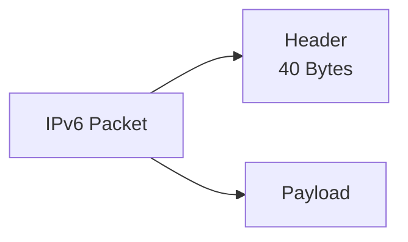
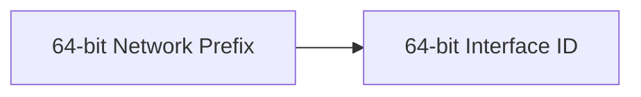
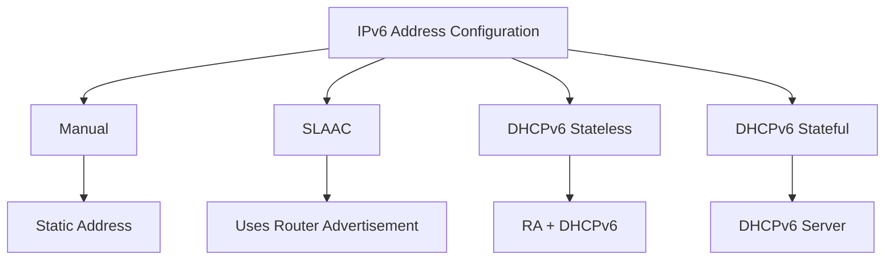
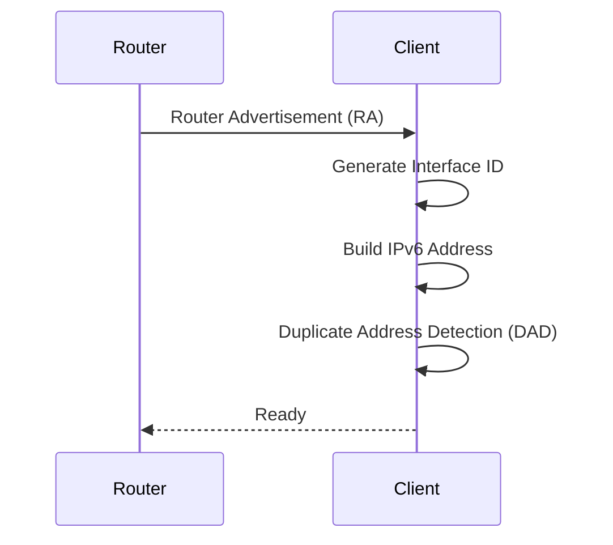

# IPv6 (Internet Protocol Version 6)

> **IPv6** is a **Layer 3 (Network Layer)** protocol designed to replace IPv4 by providing a much larger address space and more efficient packet processing.

---

# Why IPv6?

IPv4 provides approximately **4.3 billion** addresses, which are no longer enough due to the rapid growth of the Internet.

IPv6 solves this problem by providing:

- 128-bit addressing
- Vast address space
- Simplified header
- Faster routing
- Built-in IPsec support
- Auto-configuration
- No Broadcast (uses Multicast instead)
- Better scalability

---

# IPv6 Characteristics

| Feature | Value |
|---------|-------|
| Layer | Layer 3 (Network) |
| Address Length | 128 Bits |
| Header Size | 40 Bytes (Fixed) |
| Address Format | 8 Hexadecimal Groups |
| Number System | Hexadecimal |
| Broadcast | Not Supported |
| Communication | Unicast, Multicast, Anycast |
| Configuration | Manual, SLAAC, DHCPv6 |
| Fragmentation | Source Host Only |

---

# IPv6 Packet Structure

An IPv6 packet consists of:



---

# IPv6 Header

Unlike IPv4, the IPv6 header has a **fixed size (40 Bytes)** and contains fewer fields, making packet forwarding faster.

```text
+---------------------------------------------------------------+
| Version | Traffic Class | Flow Label                         |
+---------------------------------------------------------------+
| Payload Length | Next Header | Hop Limit                     |
+---------------------------------------------------------------+
|                                                       |
|           Source IPv6 Address (128 Bits)              |
|                                                       |
+---------------------------------------------------------------+
|                                                       |
|        Destination IPv6 Address (128 Bits)            |
|                                                       |
+---------------------------------------------------------------+
|                     Payload                           |
+---------------------------------------------------------------+
```

---

# IPv6 Header Fields

## Version

Specifies the IP version.

```
IPv6 = 6
```

---

## Traffic Class

Equivalent to the IPv4 DSCP field.

Used for:

- Quality of Service (QoS)
- Packet Prioritization

Example:

Voice traffic can receive higher priority than file downloads.

---

## Flow Label

Identifies packets that belong to the same communication flow.

Allows routers to process packets more efficiently.

Example:

- Video Streaming
- Voice Calls
- Online Gaming

---

## Payload Length

Specifies the size of the data after the IPv6 header.

Does **not** include the 40-byte header.

---

## Next Header

Indicates what follows the IPv6 header.

Examples:

| Protocol | Value |
|----------|-------|
| TCP | 6 |
| UDP | 17 |
| ICMPv6 | 58 |
| Routing Header | 43 |
| Fragment Header | 44 |

---

## Hop Limit

Replaces the IPv4 **TTL (Time To Live)** field.

Each router decreases the Hop Limit by **1**.

When it reaches **0**, the packet is discarded.

Example

```
Hop Limit = 64

↓

Router 1 = 63

↓

Router 2 = 62

↓

0

↓

Packet Dropped
```

---

## Source Address

The IPv6 address of the sender.

Length:

```
128 Bits
```

---

## Destination Address

The IPv6 address of the receiver.

Length:

```
128 Bits
```

---

# IPv6 Address Structure

An IPv6 address contains **128 bits** divided into **8 hexadecimal groups**.

Example

```
2001:0DB8:0000:1111:1234:5678:90AB:CDEF
```

Each group contains:

```
16 Bits
```

Each hexadecimal digit represents:

```
4 Bits
```

---

# Address Grouping

```text
2001 : 0DB8 : 0000 : 1111 : 1234 : 5678 : 90AB : CDEF
│       │       │       │       │       │       │
16b    16b    16b    16b    16b    16b    16b    16b
```

Total:

```
8 Groups

↓

16 Bits each

↓

128 Bits
```

---

# Network Prefix & Interface ID

Most IPv6 networks use a **/64 Prefix**.

```
2001:DB8:1:10::15/64
```

```
Network Prefix          Interface ID

2001:DB8:1:10 | 0000:0000:0000:0015
```



---

# IPv6 Address Compression

Leading zeros may be removed.

Example

```
2001:0DB8:0000:0000:0000:0025:0000:0001

↓

2001:DB8:0:0:0:25:0:1
```

---

Consecutive groups of zeros may be replaced with **::**

Example

```
2001:DB8:0:0:0:25:0:1

↓

2001:DB8::25:0:1
```

Rules

- Remove leading zeros.
- "::" can appear **only once**.

---

# IPv6 Address Configuration Methods

IPv6 supports several methods of obtaining an address.



---

# 1. Manual Configuration (Static)

The administrator manually configures:

- IPv6 Address
- Prefix Length
- Default Gateway
- DNS Server

Example

```
Address

2001:DB8:1:10::10/64

Gateway

2001:DB8:1:10::1

DNS

2001:4860:4860::8888
```

Used for:

- Servers
- Routers
- Network Devices

---

# 2. EUI-64

> **EUI-64** is a method used to automatically generate the **Interface ID** from the network interface's **MAC address**.

MAC Address

```
00-1A-2B-3C-4D-5E
```

Process

1. Split MAC into two halves.

```
001A2B

3C4D5E
```

2. Insert

```
FFFE
```

```
001A2B:FFFE:3C4D5E
```

3. Flip the 7th bit (Universal/Local bit).

Result

```
021A:2BFF:FE3C:4D5E
```

Final IPv6 Address

```
2001:DB8:1:10:021A:2BFF:FE3C:4D5E
```

Advantages

- Automatic
- No DHCP Server

Disadvantages

- MAC Address can be identified
- Privacy concerns

---

# 3. SLAAC (Stateless Address Auto Configuration)

The client automatically creates its own IPv6 address.

Requirements

- Router Advertisement (RA)
- Prefix Information

Process



Characteristics

- No DHCP Server
- Automatic
- Uses Neighbor Discovery Protocol (NDP)

---

# 4. DHCPv6 Stateless

The IPv6 address comes from **SLAAC**, while the DHCPv6 server provides additional information.

DHCPv6 supplies:

- DNS Server
- Domain Name
- Other Options

Address Source

```
SLAAC
```

DNS Source

```
DHCPv6
```

---

# 5. DHCPv6 Stateful

The DHCPv6 server assigns:

- IPv6 Address
- Prefix Length
- DNS Server
- Other Configuration

Everything comes from DHCPv6.

Similar to DHCP in IPv4.


---

# Configuration Comparison

| Method | Address Source | DHCP Server | Router Advertisement |
|---------|----------------|-------------|-----------------------|
| Manual | Administrator | No | No |
| EUI-64 | MAC Address | No | Optional |
| SLAAC | Client | No | Yes |
| DHCPv6 Stateless | SLAAC | Yes (DNS Only) | Yes |
| DHCPv6 Stateful | DHCPv6 Server | Yes | Yes |

---

# Quick Comparison

| Method | Address | DNS | Automatic |
|---------|---------|-----|-----------|
| Manual | Manual | Manual | No |
| EUI-64 | Automatic | Manual | Yes |
| SLAAC | Automatic | Usually RA | Yes |
| Stateless DHCPv6 | SLAAC | DHCPv6 | Yes |
| Stateful DHCPv6 | DHCPv6 | DHCPv6 | Yes |

---

# Memory Tips

```
Manual

Everything entered manually.

-----------------------

EUI-64

MAC Address

↓

Creates Interface ID

-----------------------

SLAAC

Router

↓

Client builds Address

-----------------------

Stateless DHCPv6

Address → SLAAC

DNS → DHCPv6

-----------------------

Stateful DHCPv6

Everything

↓

DHCPv6 Server
```

---

# Cheat Sheet

```text
IPv6
-----
Layer           : 3
Address Length  : 128 Bits
Header          : 40 Bytes
Broadcast       : Not Supported

Header Fields
-------------
Version
Traffic Class
Flow Label
Payload Length
Next Header
Hop Limit
Source Address
Destination Address

Address Structure
-----------------
8 Groups
16 Bits per Group
128 Bits Total

Common Prefix
-------------
/64

Configuration
-------------
Manual
EUI-64
SLAAC
DHCPv6 Stateless
DHCPv6 Stateful

Remember
--------
TTL -> Hop Limit
Protocol -> Next Header
No ARP -> NDP
No Broadcast
Uses Multicast
```