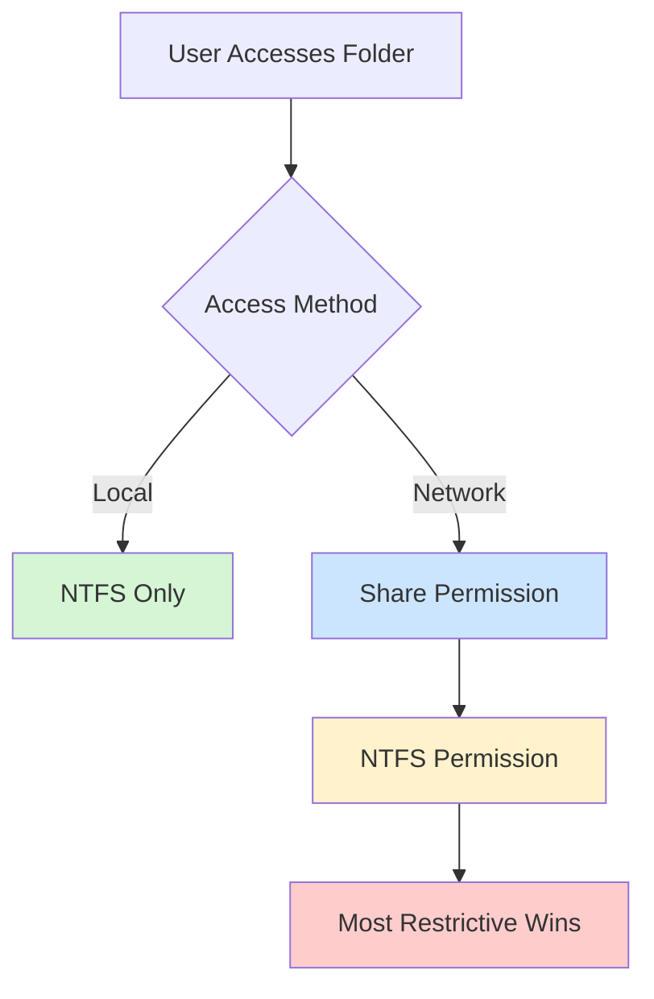
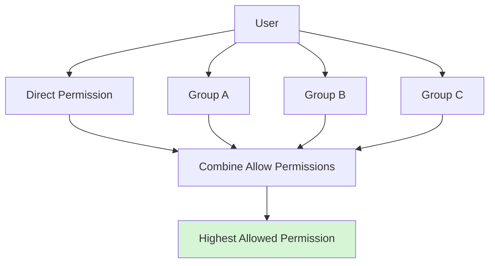

![[MCSA/Sharing Permissions/Pasted image 20260716175319.png]]

![[MCSA/Sharing Permissions/Pasted image 20260716175352.png]]

![[MCSA/Sharing Permissions/Pasted image 20260716175615.png]]

![[MCSA/Sharing Permissions/Pasted image 20260716175650.png]]

![[MCSA/Sharing Permissions/Pasted image 20260716175919.png]]


![[MCSA/Sharing Permissions/Pasted image 20260717152832.png]]

![[MCSA/Sharing Permissions/Pasted image 20260717152907.png]]

# Server manager

![[MCSA/Sharing Permissions/Pasted image 20260717164950.png]]

![[MCSA/Sharing Permissions/Pasted image 20260717165023.png]]

![[MCSA/Sharing Permissions/Pasted image 20260717165124.png]]

![[MCSA/Sharing Permissions/Pasted image 20260717165142.png]]

![[MCSA/Sharing Permissions/Pasted image 20260717165159.png]]

![[MCSA/Sharing Permissions/Pasted image 20260717165214.png]]


- Set Sessions
![[MCSA/Sharing Permissions/Pasted image 20260718144811.png]]

# Share folder for user 

## on user computer 

![[MCSA/Sharing Permissions/Pasted image 20260718150413.png]]

![[MCSA/Sharing Permissions/Pasted image 20260718150438.png]]

![[MCSA/Sharing Permissions/Pasted image 20260718150452.png]]


## on dc

![[MCSA/Sharing Permissions/Pasted image 20260718145048.png]]

![[MCSA/Sharing Permissions/Pasted image 20260718145120.png]]

![[MCSA/Sharing Permissions/Pasted image 20260718145205.png]]

![[MCSA/Sharing Permissions/Pasted image 20260718145256.png]]

> [!TIP] Compute name not user 

![[MCSA/Sharing Permissions/Pasted image 20260718150547.png]]

# Anther way


![[MCSA/Sharing Permissions/Pasted image 20260718155814.png]]

![[MCSA/Sharing Permissions/Pasted image 20260718155843.png]]

![[MCSA/Sharing Permissions/Pasted image 20260718155918.png]]

![[MCSA/Sharing Permissions/Pasted image 20260718155939.png]]

![[MCSA/Sharing Permissions/Pasted image 20260718155958.png]]

![[MCSA/Sharing Permissions/Pasted image 20260718160044.png]]

![[MCSA/Sharing Permissions/Pasted image 20260718160103.png]]

![[MCSA/Sharing Permissions/Pasted image 20260718160132.png]]

![[MCSA/Sharing Permissions/Pasted image 20260718160146.png]]
![[MCSA/Sharing Permissions/Pasted image 20260718160206.png]]

## NFS share
![[MCSA/Sharing Permissions/Pasted image 20260718160425.png]]

![[MCSA/Sharing Permissions/Pasted image 20260718160631.png]]

![[MCSA/Sharing Permissions/Pasted image 20260718160742.png]]

# What are Share Permissions?

Share Permissions control **who can access a shared folder over the network**.

- ✅ Apply only when accessing through `\\Server\Share`
- ❌ Do **not** apply to local access

---

# Permission Levels

| Permission | Read | Create | Modify | Delete | Change Permissions | Take Ownership |
|------------|:---:|:------:|:------:|:------:|:-----------------:|:--------------:|
| **Read** | ✅ | ❌ | ❌ | ❌ | ❌ | ❌ |
| **Change** | ✅ | ✅ | ✅ | ✅ | ❌ | ❌ |
| **Full Control** | ✅ | ✅ | ✅ | ✅ | ✅ | ✅ |

### Permission Order

```
Read
   ↓
Change
   ↓
Full Control
```

---

# Default Permission

When a folder is shared, Windows typically assigns:

```
Everyone → Read
```

> **Best Practice**
>
> Remove **Everyone** and grant permissions only to the required security groups or users.

---

# Hidden Share

A hidden share ends with **`$`**.

Example:

```
Data$
```

Access:

```
\\Server\Data$
```

### Notes

- Hidden ≠ Secure
- Users who know the UNC path can still access it if they have permission.
- The `$` only hides the share from normal browsing.

---

# Share vs NTFS Permissions

| Feature | Share Permission | NTFS Permission |
|----------|-----------------|-----------------|
| Local Access | ❌ | ✅ |
| Network Access | ✅ | ✅ |
| Configured From | Sharing Tab | Security Tab |
| Permission Levels | 3 | Many |
| Applies To | Shared Folder | Files & Folders |

---

# How Windows Calculates Permissions



---

# Effective Permission Examples

## Example 1

| Share | NTFS | Result |
|--------|------|--------|
| Full Control | Read | **Read** |

---

## Example 2

| Share | NTFS | Result |
|--------|------|--------|
| Read | Full Control | **Read** |

---

## Example 3

| Share | NTFS | Result |
|--------|------|--------|
| Change | Modify | **Modify** *(Most Restrictive)* |

---

# Permission Inheritance Through Groups

A user receives permissions from **all** groups they belong to.

Windows combines **Allow** permissions from all memberships.

---

## Case 1 — Permission Through Group

```
Ahmed
   │
Member Of
   │
Sales Group
   │
Share Permission
   ▼
Change
```

Result:

```
Ahmed = Change
```

---

## Case 2 — User Has No Direct Permission

```
Ahmed
   │
(No Direct Permission)
   │
Member Of
   ▼
Sales Group (Read)
```

Result:

```
Ahmed = Read
```

The user still has access because the permission comes from the group.

---

## Case 3 — Multiple Groups

```
Ahmed

├── Sales Group → Read
└── Managers Group → Change
```

Result:

```
Ahmed = Change
```

**Allow permissions are cumulative** (the highest allowed permission is effective).

---

## Case 4 — Direct User Permission + Group Permission

```
Ahmed → Read

Sales Group → Change
```

Result:

```
Ahmed = Change
```

Permissions are combined.

---

## Case 5 — Multiple Groups

| Group | Permission |
|--------|------------|
| Sales | Read |
| HR | Change |
| Managers | Full Control |

Result:

```
Effective Permission = Full Control
```

---

# Permission Combination Diagram



---

# When NTFS Is Also Applied


---

# Permission Rules

### ✔ Allow Permissions

- Permissions from different groups are **combined**.
- Users inherit permissions from every group they belong to.

### ✔ Direct + Group

```
User Permission
        +
Group Permission
        =
Combined Permission
```

### ✔ Network Access

```
Effective Share Permission
            +
Effective NTFS Permission
            =
Most Restrictive Permission
```

---

# Memory Tricks

## Share Permissions

```
Read
   ↓
Change
   ↓
Full Control
```

---

## Permission Evaluation

```
User
   +
Groups
   ↓
Combine Allow Permissions
   ↓
Effective Share Permission
   ↓
Compare with NTFS
   ↓
Most Restrictive Wins
```

---

# Tips

✅ Share permissions apply **only over the network**.

✅ NTFS permissions apply **locally and over the network**.

✅ Users inherit permissions from **all groups** they belong to.

✅ **Allow permissions are cumulative**.

✅ Direct user permissions and group permissions are **combined**.

✅ After Share permissions are calculated, Windows compares them with NTFS permissions.

✅ **The most restrictive permission is the final effective permission**.

✅ A hidden share (`$`) is **hidden**, **not secure**.

✅ Configure Share Permissions from the **Sharing** tab.

✅ Configure NTFS Permissions from the **Security** tab.


---
# Hidden Shares (Administrative Shares)

A **Hidden Share** is a network share whose name ends with a **`$`** sign. It is hidden from normal network browsing but can still be accessed if the user knows the share name and has the required permissions.

![[MCSA/Sharing Permissions/Pasted image 20260717152448.png]]


---

## Access a Hidden Share

![[MCSA/Sharing Permissions/Pasted image 20260717152705.png]]


Use the UNC path:

```text
\\ServerName\Data$
```

Example:

```text
\\pdc\data$
```

---

## Default Administrative Hidden Shares

| Share | Purpose |
|--------|---------|
| `C$`, `D$`, ... | Administrative access to drive roots |
| `ADMIN$` | Windows directory (usually `C:\Windows`) |
| `IPC$` | Inter-Process Communication (used for remote administration) |
| `PRINT$` | Printer driver files |

> **Note:** These shares are created automatically on Windows Server and are accessible only to users with appropriate administrative permissions.
