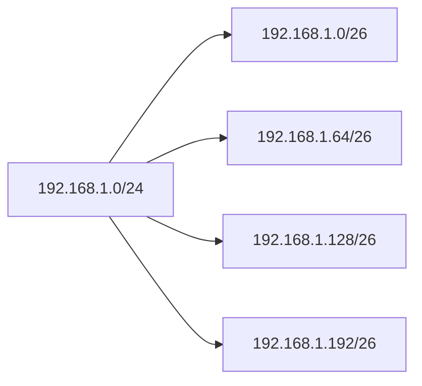

# IPv4 Subnetting

> **Subnetting** is the process of dividing one large network into multiple smaller networks (subnets).

---

# Why Subnet?

Subnetting helps to:

- Reduce broadcast traffic
- Improve network performance
- Better IP address utilization
- Increase security
- Simplify network management

---

# Basic Terms

| Term | Description |
|------|-------------|
| Network Address | Identifies the network |
| Host Address | Identifies a device |
| Broadcast Address | Sends data to all hosts in the subnet |
| Subnet Mask | Separates Network and Host portions |
| Prefix Length | Number of network bits (e.g., /24) |

---

# IPv4 Structure

An IPv4 address consists of **32 bits (4 octets)**.

Example:

```
IP Address : 192.168.1.10
Prefix     : /24
Subnet Mask: 255.255.255.0
```

Binary representation:

```
11000000.10101000.00000001.00001010
```

With a `/24` prefix:

```
Network Portion        Host Portion
--------------------|--------------
192.168.1            .10
```

---

# Prefix Length Table

| Prefix | Subnet Mask | Hosts | Increment |
|---------|-------------|------:|----------:|
| /24 | 255.255.255.0 | 254 | 256 |
| /25 | 255.255.255.128 | 126 | 128 |
| /26 | 255.255.255.192 | 62 | 64 |
| /27 | 255.255.255.224 | 30 | 32 |
| /28 | 255.255.255.240 | 14 | 16 |
| /29 | 255.255.255.248 | 6 | 8 |
| /30 | 255.255.255.252 | 2 | 4 |

---

# Borrowing Bits

Subnetting works by borrowing bits from the **Host** portion.

Example:

Default Class C:

```
11111111.11111111.11111111.00000000
                           ↑
                        Host Bits
```

After borrowing **2 bits**:

```
11111111.11111111.11111111.11000000
                           ↑↑
                      Borrowed Bits
```

Result:

- Prefix = **/26**
- Network Bits = **26**
- Host Bits = **6**

---

# Subnetting Formulas

## Number of Subnets

```
Subnets = 2^(Borrowed Bits)
```

Example:

Borrow 3 bits:

```
2³ = 8 Subnets
```

---

## Number of Hosts

```
Hosts = 2^(Host Bits) - 2
```

Subtract 2 because:

- Network Address
- Broadcast Address

Example:

```
Host Bits = 5

2⁵ - 2

32 - 2

30 Hosts
```

---

# Subnet Increment (Block Size)

Formula:

```
Increment = 256 - Interesting Octet
```

Example:

```
Subnet Mask

255.255.255.192

256 - 192 = 64
```

Network addresses:

```
0
64
128
192
```

---

# Finding a Subnet

Example:

```
IP Address : 192.168.10.130
Prefix     : /26
```

Mask:

```
255.255.255.192
```

Increment:

```
256 - 192 = 64
```

Subnet ranges:

```
0
64
128
192
```

Since **130** is between **128–191**:

```
Network Address   : 192.168.10.128
First Host        : 192.168.10.129
Last Host         : 192.168.10.190
Broadcast Address : 192.168.10.191
```

---

# Example (/26)

| Network | First Host | Last Host | Broadcast |
|----------|------------|-----------|-----------|
| .0 | .1 | .62 | .63 |
| .64 | .65 | .126 | .127 |
| .128 | .129 | .190 | .191 |
| .192 | .193 | .254 | .255 |

Hosts per subnet:

```
62
```

---

# Example (/27)

Subnet Mask:

```
255.255.255.224
```

Increment:

```
32
```

Networks:

```
0
32
64
96
128
160
192
224
```

Hosts:

```
30
```

---

# Example (/28)

Subnet Mask:

```
255.255.255.240
```

Increment:

```
16
```

Networks:

```
0
16
32
48
64
80
96
112
128
...
```

Hosts:

```
14
```

---

# Example (/30)

Subnet Mask:

```
255.255.255.252
```

Increment:

```
4
```

Each subnet contains:

```
Network
Host
Host
Broadcast
```

Hosts:

```
2
```

Common use:

- Point-to-Point (Router-to-Router) links

---

# Visual Example



---

# Subnetting Steps

1. Write the Prefix Length.
2. Convert it to a Subnet Mask.
3. Find the Interesting Octet.
4. Calculate the Increment:

```
256 − Mask
```

5. List the subnet ranges.
6. Find where the IP belongs.
7. Determine:
   - Network Address
   - First Host
   - Last Host
   - Broadcast Address

---

# Quick Memory Table

| Prefix | Mask | Hosts | Increment |
|---------|------|------:|----------:|
| /24 | 255.255.255.0 | 254 | 256 |
| /25 | 255.255.255.128 | 126 | 128 |
| /26 | 255.255.255.192 | 62 | 64 |
| /27 | 255.255.255.224 | 30 | 32 |
| /28 | 255.255.255.240 | 14 | 16 |
| /29 | 255.255.255.248 | 6 | 8 |
| /30 | 255.255.255.252 | 2 | 4 |

