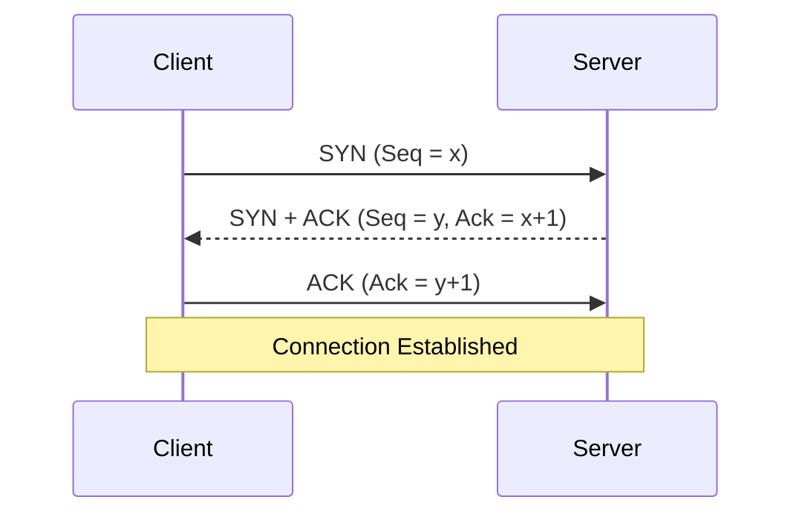
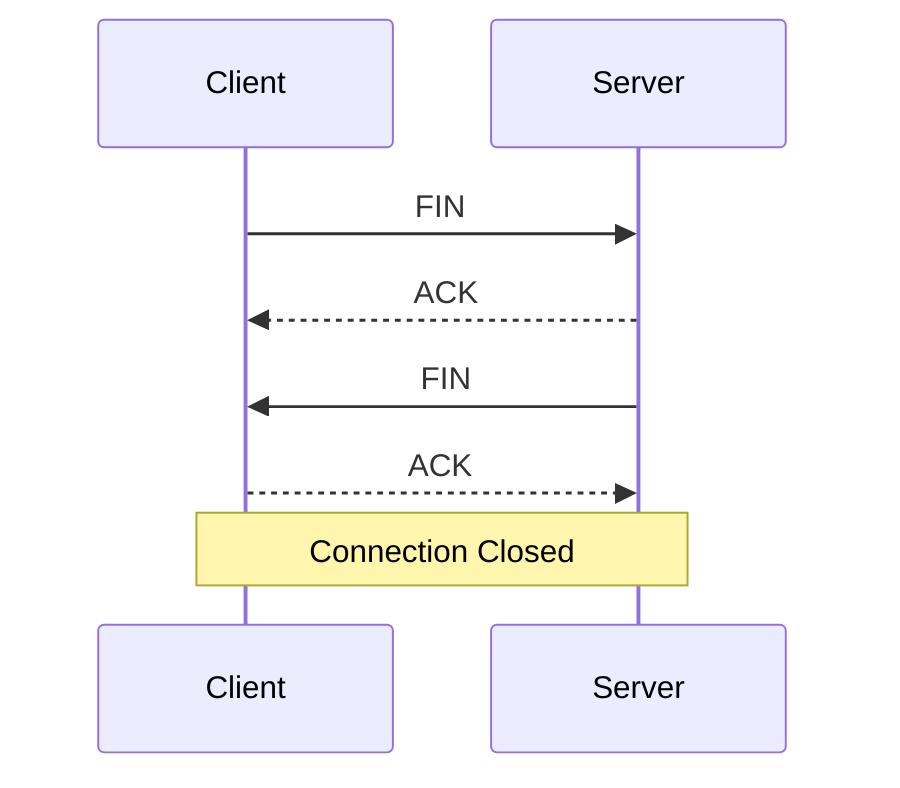
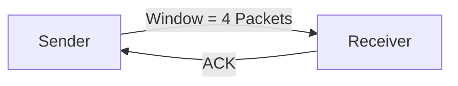
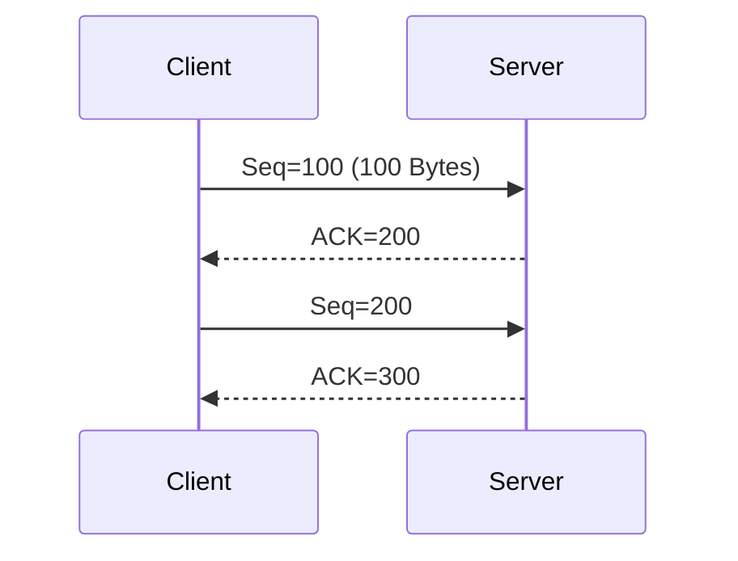

# TCP (Transmission Control Protocol)

> A **connection-oriented**, **reliable** transport layer protocol that guarantees data delivery.

---

## Characteristics

- Connection-Oriented
- Reliable Delivery
- Error Detection
- Flow Control
- Congestion Control
- Ordered Data Delivery
- Full-Duplex Communication

---

# TCP Header

## Header Structure

![[TCP-Header-Format.png]]

---

## TCP Header Fields

| Field | Purpose |
|--------|----------|
| Source Port | Sender's application port |
| Destination Port | Receiver's application port |
| Sequence Number | Tracks transmitted bytes |
| Acknowledgment Number | Confirms received data |
| Header Length | Size of TCP header |
| Flags | Control TCP communication |
| Window Size | Flow control |
| Checksum | Error detection |
| Urgent Pointer | Indicates urgent data |
| Options | MSS, Window Scaling, Timestamps, etc. |

---

# TCP Flags

| Flag | Full Name | Purpose |
|------|-----------|---------|
| SYN | Synchronize | Start a connection |
| ACK | Acknowledgment | Confirms received data |
| FIN | Finish | Gracefully close a connection |
| RST | Reset | Immediately terminate a connection |
| PSH | Push | Deliver data immediately |
| URG | Urgent | Urgent data present |
| ECE | ECN Echo | Congestion notification |
| CWR | Congestion Window Reduced | Congestion response |
| NS | Nonce Sum | ECN protection (rarely used) |

---

## Most Important Flags

### SYN
- Starts a TCP connection.
- Synchronizes sequence numbers.

### ACK
- Acknowledges received packets.
- Used in almost every TCP segment after the connection begins.

### FIN
- Requests a graceful connection termination.

### RST
- Immediately resets a connection.
- Used when a connection is invalid or refused.

### PSH
- Sends data immediately to the receiving application without buffering.

### URG
- Indicates urgent data should be processed first.

---

# TCP Three-Way Handshake

Used to establish a reliable connection.



---

## Steps

### Step 1 — SYN

Client sends:

```
SYN
Seq = x
```

Meaning:

> "I want to establish a connection."

---

### Step 2 — SYN + ACK

Server replies:

```
SYN
ACK
Seq = y
Ack = x + 1
```

Meaning:

> "I received your request and I'm ready."

---

### Step 3 — ACK

Client replies:

```
ACK
Ack = y + 1
```

Meaning:

> "Connection established."

---

## Easy Memory

```
Client: Can we talk?
Server: Yes, let's talk.
Client: Great!
```

or

```
SYN
SYN + ACK
ACK
```

---

# TCP Four-Way Handshake (Connection Termination)

TCP closes each direction independently.



---

## Steps

### Step 1

Client sends:

```
FIN
```

Meaning:

> "I'm finished sending data."

---

### Step 2

Server replies:

```
ACK
```

Meaning:

> "I received your FIN."

---

### Step 3

When the server is ready, it sends:

```
FIN
```

Meaning:

> "I'm finished too."

---

### Step 4

Client replies:

```
ACK
```

Meaning:

> "Connection closed."

---

## Easy Memory

```
Client: Bye
Server: OK
Server: Bye
Client: OK
```

---

# Why Four Steps?

TCP is **Full-Duplex**.

Each device closes its sending direction independently.

---

# TCP Reliability

TCP guarantees delivery using:

- Sequence Numbers
- ACKs
- Retransmissions
- Checksum
- Sliding Window
- Flow Control

---

# Sliding Window

Controls how much data can be sent before waiting for an ACK.



Larger window = Higher throughput.

---

# TCP Sequence & ACK Numbers



ACK always means:

> **"I expect the next byte to be..."**

