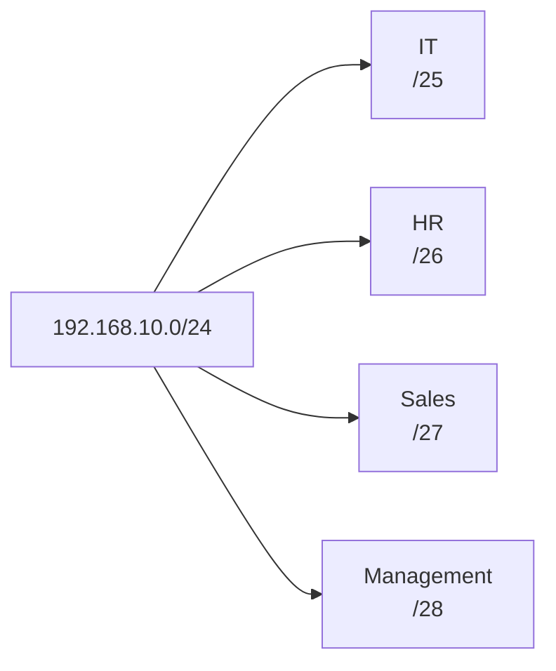
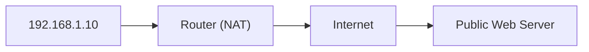

# VLSM (Variable Length Subnet Mask)

> **VLSM** allows you to use **different subnet masks (prefix lengths)** within the same network, creating subnets of different sizes based on the number of hosts required.

Unlike Fixed-Length Subnet Mask (FLSM), VLSM prevents wasting IP addresses.

---

# Why Use VLSM?

Benefits:

- Efficient IP address utilization
- Reduces wasted addresses
- Supports networks of different sizes
- More scalable
- Commonly used in enterprise networks

---

# FLSM vs VLSM

| Feature | FLSM | VLSM |
|---------|------|------|
| Subnet Size | All Equal | Different Sizes |
| IP Utilization | Poor | Excellent |
| Flexibility | Low | High |
| Recommended Today | ❌ | ✅ |

---

# Example

Network:

```
192.168.10.0/24
```

Requirements:

| Department | Hosts Needed |
|------------|-------------:|
| IT | 100 |
| HR | 50 |
| Sales | 20 |
| Management | 10 |

Using **FLSM**, every subnet would be the same size.

Using **VLSM**, each department receives only the addresses it needs.

---

# VLSM Allocation

| Department | Hosts | Prefix | Subnet |
|------------|------:|--------|---------|
| IT | 100 | /25 | 192.168.10.0/25 |
| HR | 50 | /26 | 192.168.10.128/26 |
| Sales | 20 | /27 | 192.168.10.192/27 |
| Management | 10 | /28 | 192.168.10.224/28 |

---

# VLSM Example Diagram



---

# VLSM Tips

- Always allocate the **largest subnet first**.
- Never overlap subnet ranges.
- Use the smallest subnet that satisfies the host requirement.
- Leave unused addresses for future expansion when possible.

---

# Private IPv4 Addresses

> **Private IPv4 addresses** are reserved for internal networks and **cannot be routed over the Internet**.

Devices using private addresses access the Internet through **NAT (Network Address Translation)**.

---

# Private Address Ranges

| Class | Address Range | Prefix |
|--------|---------------|--------|
| A | 10.0.0.0 – 10.255.255.255 | /8 |
| B | 172.16.0.0 – 172.31.255.255 | /12 |
| C | 192.168.0.0 – 192.168.255.255 | /16 |

---

# Common Uses

### Home Networks

```
192.168.1.x
```

### Small Business

```
192.168.x.x
```

### Enterprise Networks

```
10.x.x.x
```

### Medium Organizations

```
172.16.x.x
```

---

# Public vs Private

| Feature | Private IP | Public IP |
|----------|------------|-----------|
| Internet Routable | ❌ No | ✅ Yes |
| Globally Unique | ❌ No | ✅ Yes |
| Free to Use | ✅ Yes | ❌ Assigned by ISP |
| Requires NAT for Internet | ✅ Yes | ❌ No |

---

# NAT



Example:

```
Private IP

192.168.1.10

↓

NAT

↓

Public IP

41.33.120.15
```

---

# Reserved IPv4 Addresses

| Address | Purpose |
|----------|---------|
| 0.0.0.0 | Default Route / This Network |
| 127.0.0.0/8 | Loopback |
| 169.254.0.0/16 | APIPA (Automatic Private IP Addressing) |
| 255.255.255.255 | Limited Broadcast |

---

# APIPA

When a Windows computer cannot contact a DHCP server, it automatically assigns itself an address from:

```
169.254.0.0/16
```

Example:

```
169.254.10.20
```

This allows communication only with devices on the same local network.
