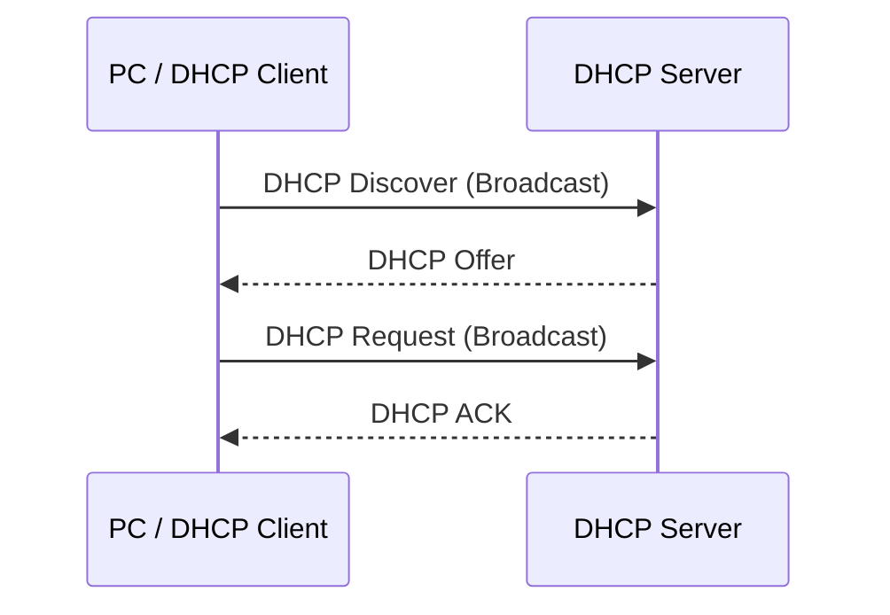

# DHCP

## DHCP

* **DHCP (Dynamic Host Configuration Protocol)**
* Automatically provides network configuration to clients:

  * IP Address
  * Subnet Mask
  * Default Gateway
  * DNS Server
  * Lease Time

---

# DHCP DORA Process



### D → Discover

* Client broadcasts to find a DHCP Server.

### O → Offer

* DHCP Server offers an available IP address.

### R → Request

* Client requests the offered IP address.

### A → ACK

* DHCP Server confirms the lease.

> **DORA = Discover → Offer → Request → ACK**

* If multiple DHCP Servers respond:

  * Client normally accepts the first suitable offer.

---

# DHCP Lease

* A **DHCP Lease** is the amount of time a client can use an IP address.
* Windows Server DHCP default lease duration:

  * **8 days**

## Lease Renewal

### 50% → T1

* Client tries to renew the lease.
* Normally contacts the **original DHCP Server**.

### 87.5% → T2

* If the original DHCP Server is unavailable:

  * Client enters **rebind** state.
  * Broadcasts to find any available DHCP Server.

### 100% → Expire

* Lease expires.
* Client must obtain a valid lease again.
* If DHCP is unavailable, Windows may use **APIPA**.

### 8-Day Example

```text
Lease = 8 Days

50%   → 4 Days   → Renew
87.5% → 7 Days   → Rebind
100%  → 8 Days   → Expire
```

> **Remember**
>
> * 50% → Renew
> * 87.5% → Rebind
> * 100% → Expire

---

# APIPA

* **APIPA = Automatic Private IP Addressing**
* Windows can automatically assign an IP when DHCP is unavailable.
* Range:

```text
169.254.0.0/16
```

* Example:

```text
169.254.20.15
```

* APIPA addresses:

  * Are mainly used for local-network communication.
  * Are not normally routed between networks.
  * Do not provide normal Internet connectivity.

## If a PC gets `169.254.x.x`

Check:

* DHCP Server service
* Network connection
* DHCP Scope
* DHCP Server authorization
* VLAN configuration
* DHCP Relay
* Firewall
* Network configuration

> **169.254.x.x = APIPA → DHCP problem**

---

# Install DHCP

## Before Installing DHCP

* DHCP Server should use a **Static IP**.
* Example:

```text
Gateway:    192.168.100.1
DHCP Server: 192.168.100.100
```

---

# (01) Install DHCP Role

![[MCSA/DHCP/Pasted image 20260830193313.png]]

![[MCSA/DHCP/Pasted image 20260830193348.png]]

---

# (02) Configure DHCP Server

![[MCSA/DHCP/Pasted image 20260830203814.png]]

![[MCSA/DHCP/Pasted image 20260830203918.png]]

![[MCSA/DHCP/Pasted image 20260830204050.png]]

![[MCSA/DHCP/Pasted image 20260830204235.png]]

![[MCSA/DHCP/Pasted image 20260830213415.png]]

---

# Network Configuration

Example network:

```text
Network:      192.168.100.0/24
Gateway:      192.168.100.1
DHCP Server:  192.168.100.100
```

### IP Plan

```text
192.168.100.1        → Gateway

192.168.100.2-20     → Static IPs

192.168.100.21-99    → DHCP Clients

192.168.100.100      → DHCP Server

192.168.100.101-254  → DHCP Clients
```

* Static IPs can be used for:

  * Servers
  * Printers
  * Network devices
  * Other devices that need a fixed IP
* Exclude static IP addresses from the DHCP Scope.

---

# DHCP Scope

* **DHCP Scope** = range of IP addresses that DHCP can assign to clients.

Example:

```text
Network:       192.168.100.0/24
DHCP Range:    192.168.100.21 - 192.168.100.254
```

A Scope can contain:

* IP Address Range
* Exclusion Range
* Lease Duration
* Reservations
* Scope Options
* DHCP Policies

![[MCSA/DHCP/Pasted image 20260830213712.png]]

![[MCSA/DHCP/Pasted image 20260830213843.png]]

![[MCSA/DHCP/Pasted image 20260830213939.png]]

![[MCSA/DHCP/Pasted image 20260830214003.png]]

![[MCSA/DHCP/Pasted image 20260830214044.png]]

![[MCSA/DHCP/Pasted image 20260830214107.png]]

> **Scope = IP range DHCP can assign**

---

# (03) Configure DHCP Client

### Open Network Connections

* Press:

```text
Windows + R
```

* Type:

```text
ncpa.cpl
```

* Press **Enter**.

![[MCSA/DHCP/Pasted image 20260831180332.png]]

![[MCSA/DHCP/Pasted image 20260831180446.png]]

![[MCSA/DHCP/Pasted image 20260831181744.png]]

![[MCSA/DHCP/Pasted image 20260831181832.png]]

![[MCSA/DHCP/Pasted image 20260831182010.png]]

---

# Check DHCP Client

Open **CMD**.

### Check IP Configuration

```cmd
ipconfig
```

or:

```cmd
ipconfig /all
```

Check:

* IPv4 Address
* Subnet Mask
* Default Gateway
* DHCP Server
* DNS Server

---

## Request a New DHCP Lease

### Release Current IP

```cmd
ipconfig /release
```

* Releases the current DHCP IP configuration.

### Request a New IP

```cmd
ipconfig /renew
```

* Requests a new DHCP lease.

> **release → Give up IP**
> **renew → Request IP**

---

# Check DHCP Address Leases

On Windows Server:

```text
Server Manager
↓
Tools
↓
DHCP
↓
IPv4
↓
Your Scope
↓
Address Leases
```

* **Address Leases** shows IP addresses currently leased to DHCP clients.

![[MCSA/DHCP/Pasted image 20260831182050.png]]

---

# Types of DHCP Scopes

## 1. Normal Scope

* Provides IP addresses to clients on one subnet.
* Example:

```text
Network: 192.168.100.0/24

Scope:
192.168.100.21
        ↓
192.168.100.254
```

* Normally used when:

  * DHCP Server and clients are on the same subnet.

> **Normal Scope = One subnet → One IP range**

---

# 2. Superscope

* A **Superscope** combines multiple DHCP scopes into one logical group.
* Each scope has its own IP range.

Example:

```text
Superscope
│
├── Scope 1 → 192.168.100.0/24
│
└── Scope 2 → 192.168.101.0/24
```

* Useful when:

  * Multiple scopes are needed on the same physical network.
  * You need additional IP address ranges.
  * Multiple logical subnets are used.

> **Superscope = Multiple scopes → One group**

---

# 3. DHCP Multicast Scope

* Used to assign **multicast IP addresses**.
* Multicast allows one sender to send traffic to multiple clients.

Multicast range:

```text
224.0.0.0 - 239.255.255.255
```

* Used for multicast-based applications and deployments.

> **Multicast Scope = Multicast IP addresses**

---

# DHCP Reservations

* A **Reservation** gives a specific IP address to a specific device.
* Device is identified by its **MAC Address**.
* The device receives the same IP whenever it requests DHCP.

Example:

```text
MAC Address
     ↓
192.168.100.50
```

Useful for:

* Printers
* Servers
* Network devices
* Devices that need a consistent IP

> **Reservation = Specific MAC → Specific IP**

![[MCSA/DHCP/Pasted image 20260831193009.png]]

![[MCSA/DHCP/Pasted image 20260831193142.png]]

---

# Scope Options

* **Scope Options** provide additional network configuration to DHCP clients.

### Common Options

| Option  | Purpose         |
| ------- | --------------- |
| **003** | Default Gateway |
| **006** | DNS Server      |
| **015** | DNS Domain Name |

Example:

```text
003 → 192.168.100.1
006 → 192.168.100.100
015 → example.local
```

> **Scope Options = Network settings sent to DHCP clients**

---

# DHCP Policies

* A **DHCP Policy** allows different DHCP settings for different clients.

* Clients can be identified using:

  * MAC Address
  * Vendor Class
  * User Class
  * Client Identifier
  * IP Subnet
  * DHCP Class ID

* A policy can apply:

  * Different IP ranges
  * Different Scope Options
  * Different DHCP settings

---

## Create DHCP Policy

![[MCSA/DHCP/Pasted image 20260903164026.png]]

![[MCSA/DHCP/Pasted image 20260903164116.png]]

![[MCSA/DHCP/Pasted image 20260903164235.png]]

![[MCSA/DHCP/Pasted image 20260903164302.png]]

![[MCSA/DHCP/Pasted image 20260903164325.png]]

![[MCSA/DHCP/Pasted image 20260903164404.png]]

![[MCSA/DHCP/Pasted image 20260903164456.png]]

![[MCSA/DHCP/Pasted image 20260903164534.png]]

![[MCSA/DHCP/Pasted image 20260903164711.png]]

---

## DHCP Class ID

On the client:

```cmd
ipconfig /setclassid Ethernet0 gateway
```

![[MCSA/DHCP/Pasted image 20260903165026.png]]

* The DHCP Policy can use the **Class ID** to identify the client.
* Then the policy can apply specific DHCP settings.

> **Client Class ID → DHCP Policy → Specific Settings**

---

# Quick Revision

## DORA

```text
D → Discover
O → Offer
R → Request
A → ACK
```

## Lease

```text
50%   → Renew
87.5% → Rebind
100%  → Expire
```

## APIPA

```text
169.254.0.0/16
```

## Scope

```text
Scope = IP range DHCP can assign
```

## Reservation

```text
MAC Address → Specific IP
```

## Scope Options

```text
003 → Gateway
006 → DNS
015 → Domain Name
```

## DHCP Policy

```text
Client Condition
      ↓
DHCP Policy
      ↓
Specific DHCP Settings
```

---

# Important MCSA Points

* **DHCP Server → Static IP**
* **DHCP Client → Automatic IP**
* **Scope → Range of IPs DHCP can assign**
* **Exclusion → IPs DHCP must NOT assign**
* **Reservation → Specific MAC → Specific IP**
* **Scope Options → Network configuration**
* **Address Leases → Currently leased IPs**
* **DHCP Policy → Different settings for different clients**
* `ipconfig /renew` → Request DHCP lease
* `ipconfig /release` → Release DHCP lease
* `169.254.x.x` → APIPA

---

# Lab Network

```text
Network:       192.168.100.0/24

Gateway:       192.168.100.1
DHCP Server:   192.168.100.100

Static IPs:
192.168.100.2 - 192.168.100.20

DHCP Clients:
192.168.100.21 - 192.168.100.254
```

---

# MCSA Memory Points

> **DORA** → Get an IP
> **50%** → Renew
> **87.5%** → Rebind
> **100%** → Expire
> **169.254.x.x** → APIPA
> **DHCP Server** → Static IP
> **DHCP Client** → Automatic IP
> **Reservation** → MAC → IP
> **Policy** → Different settings for different clients
