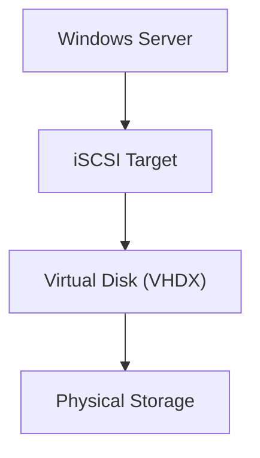
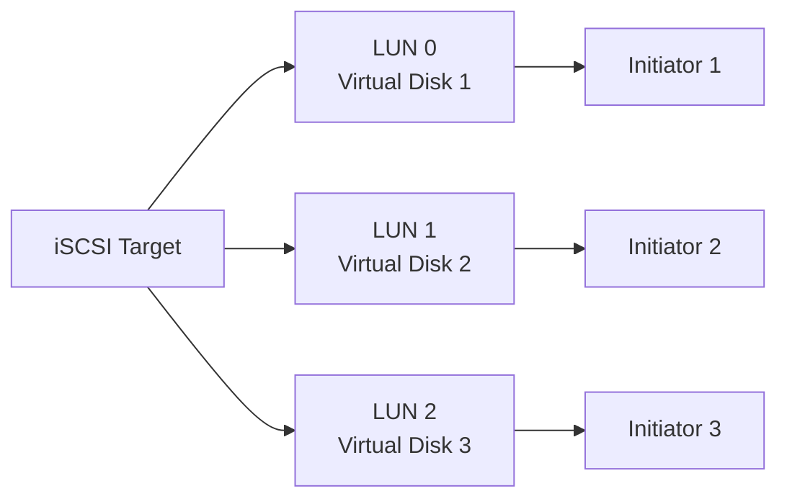
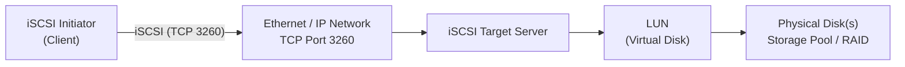

# What is iSCSI?

**iSCSI (Internet Small Computer System Interface)** is a storage protocol that allows a computer to access **remote block storage** over a standard **TCP/IP network**.

Instead of connecting a hard disk directly with a SATA or SAS cable, iSCSI sends **SCSI commands through an IP network (Ethernet)**.

The remote disk appears to Windows as if it were a **local physical disk**.

---

# Why Use iSCSI?

- Centralized storage
- Easy storage expansion
- Lower cost than Fibre Channel SAN
- Uses existing Ethernet infrastructure
- Supports virtualization
- High availability
- Windows Failover Clustering
- Hyper-V shared storage

---

# iSCSI Components

## 1. Initiator

The **Initiator** is the client requesting storage.

Examples:

- Windows Server
- Windows Client
- Hyper-V Host
- VMware ESXi
- Linux Server

Responsibilities:

- Connects to the Target
- Sends SCSI commands
- Reads and writes data

---

## 2. Target

The **Target** is the storage server that provides disks to clients.



---

## 3. Target Portal

The **Target Portal** is the IP address (and optionally the port) of the iSCSI server.

Example:

```text
192.168.1.100
```

Default Port:

```text
TCP 3260
```

---

## 4. LUN (Logical Unit Number)

A **LUN (Logical Unit Number)** uniquely identifies a **virtual disk** presented by an **iSCSI Target**.

One Target can present **multiple LUNs**, and each LUN can be assigned to one or more authorized Initiators.



> **Note:** A LUN identifies the storage device, **not the client (Initiator)**.

---

# iSCSI Architecture



### Data Flow

```text
Initiator
    │
    ▼
Ethernet/IP Network
    │
    ▼
iSCSI Target
    │
    ▼
LUN (Virtual Disk)
    │
    ▼
Physical Storage
```

---

# Install iSCSI Target Server

![[MCSA/iSCSI/Pasted image 20260803164418.png]]
![[MCSA/iSCSI/Pasted image 20260803164446.png]]
![[MCSA/iSCSI/Pasted image 20260803164510.png]]

---

# Create an iSCSI Virtual Disk

![[MCSA/iSCSI/Pasted image 20260803170859.png]]
![[MCSA/iSCSI/Pasted image 20260803171005.png]]
![[MCSA/iSCSI/Pasted image 20260803171237.png]]
![[MCSA/iSCSI/Pasted image 20260803171317.png]]
![[MCSA/iSCSI/Pasted image 20260803171354.png]]
![[MCSA/iSCSI/Pasted image 20260803171433.png|700]]
![[MCSA/iSCSI/Pasted image 20260804205206.png]]

## On initiator
![[MCSA/iSCSI/Pasted image 20260804205412.png]]
![[MCSA/iSCSI/Pasted image 20260804205506.png]]
![[MCSA/iSCSI/Pasted image 20260804205541.png]]

## Back to target 
![[MCSA/iSCSI/Pasted image 20260804205637.png]]
![[MCSA/iSCSI/Pasted image 20260804205654.png]]

## On initiator

![[MCSA/iSCSI/Pasted image 20260804205814.png]]

