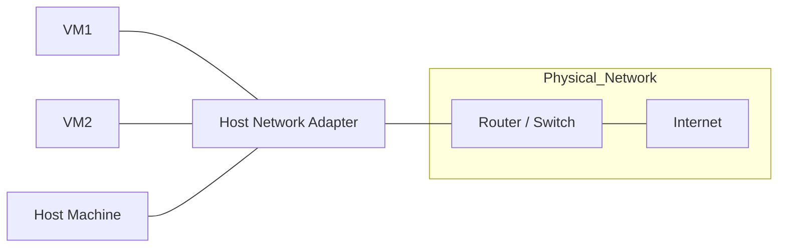

# VMware Network Connection Types
1. Bridged
```scss
          [ Router / Switch ]
                 │
   ┌─────────────┴─────────────┐
   │                           │
 [VM1]                       [VM2]
 (192.168.1.101)             (192.168.1.102)

```


    - VM connects directly to the physical network (like another real PC).
    - Gets its own IP from router/DHCP.
2. NAT (Network Address Translation)
    - VM share the host's IP to access external network.