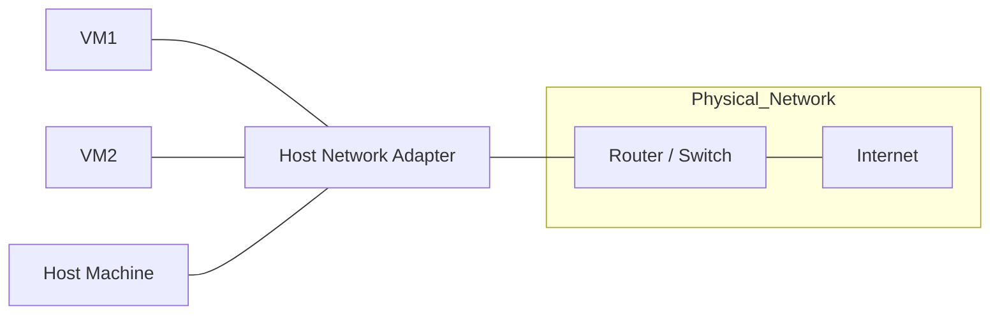

# VMware Network Connection Types
1. Bridged

2. NAT (Network Address Translation)
 ```mermaid
    flowchart LR
    subgraph NAT_Network
        VM1[VM1] --- VMnetNAT[VMware NAT Adapter]
        VM2[VM2] --- VMnetNAT
        Host[Host Machine] --- VMnetNAT
    end

    VMnetNAT --- Router[Router / Internet]

```
dsf
sdf
dfg 
