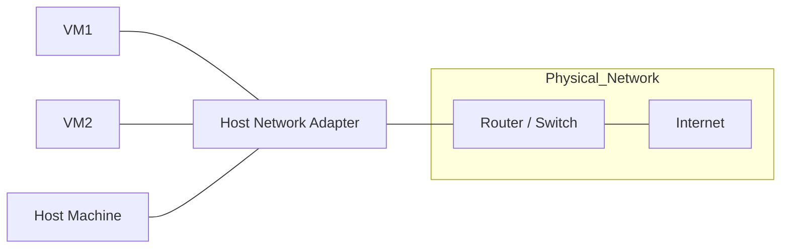
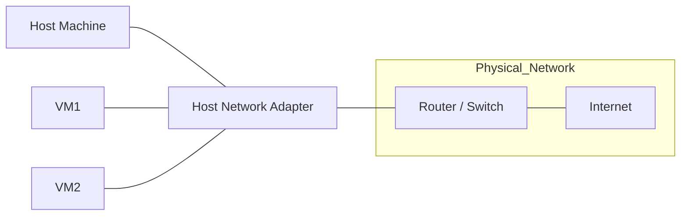
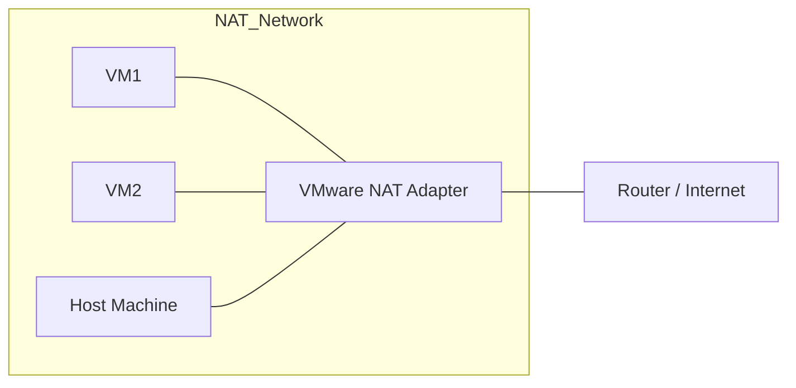
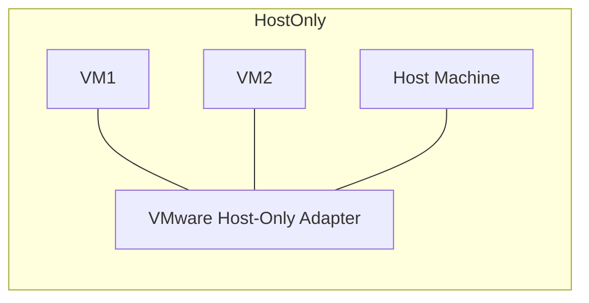
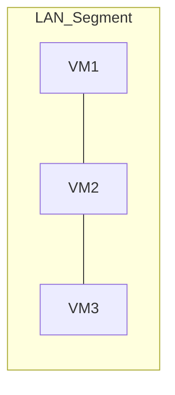

# VMware Network Connection Types
1. Bridged
```scss
                            [ Router / Switch ]
                                    │
                      ┌─────────────┴─────────────┐
                      │                           │
                    [VM1]                       [VM2]
                (192.168.1.101)             (192.168.1.102)

```


    - VM connects directly to the physical network (like another real PC).
    - Gets its own IP from router/DHCP.
2. NAT (Network Address Translation)

        - VM share the host's IP to access external network.
        
 ```mermaid
    flowchart LR
    subgraph NAT_Network
        VM1[VM1] --- VMnetNAT[VMware NAT Adapter]
        VM2[VM2] --- VMnetNAT
        Host[Host Machine] --- VMnetNAT
    end

    VMnetNAT --- Router[Router / Internet]

```


# VMware Network Connection Types

When creating a virtual machine in VMware Workstation or Player, you can choose how the VM connects to the network. Each mode affects how the VM communicates with the host, other VMs, and the internet.

There are four main connection types:

* Bridged
* NAT (Network Address Translation)
* Host-Only
* LAN Segment

---

## 1. Bridged Networking

**How it works:**

* VM connects directly to the same physical network as the host.
* It uses the host’s physical NIC (Network Interface Card).
* The VM gets an IP from your router’s DHCP server, just like the host.

**Use Case:**

* When you want your VM to behave like a real PC on your LAN.
* Useful for servers, file sharing, or testing visibility across the network.

**Diagram:**



---

## 2. NAT (Network Address Translation)

**How it works:**

* VMware creates a virtual NAT router.
* VMs get IPs from a private subnet (like `192.168.194.x`).
* When accessing the internet, VMware translates VM IP → Host IP.

**Use Case:**

* When you want the VM to access the internet safely but not be visible from outside.
* Great for client testing without exposing VM to the LAN.

**Diagram:**



---

## 3. Host-Only Networking

**How it works:**

* Creates a private network between the host and VMs only.
* No internet access by default.
* Useful for isolated labs.

**Use Case:**

* Testing malware safely.
* Creating closed environments where only host ↔ VM communication is needed.

**Diagram:**



---

## 4. LAN Segment

**How it works:**

* Creates a completely isolated virtual switch.
* Only VMs on the same LAN segment can communicate.
* No host, no internet connectivity.

**Use Case:**

* Building isolated VM labs.
* Simulating internal networks (e.g., pentesting or malware spread).

**Diagram:**



---

## Summary Table

| Mode        | VM ↔ Host | VM ↔ Internet | VM ↔ LAN Devices      | Use Case                                   |
| ----------- | --------- | ------------- | --------------------- | ------------------------------------------ |
| Bridged     | Yes       | Yes           | Yes                   | Run VM as if it’s a real PC on the network |
| NAT         | Yes       | Yes           | Limited               | Safe internet access, hide VM from network |
| Host-Only   | Yes       | No            | No (except other VMs) | Private lab with host access               |
| LAN Segment | No        | No            | VM-to-VM only         | Isolated lab, malware testing              |
