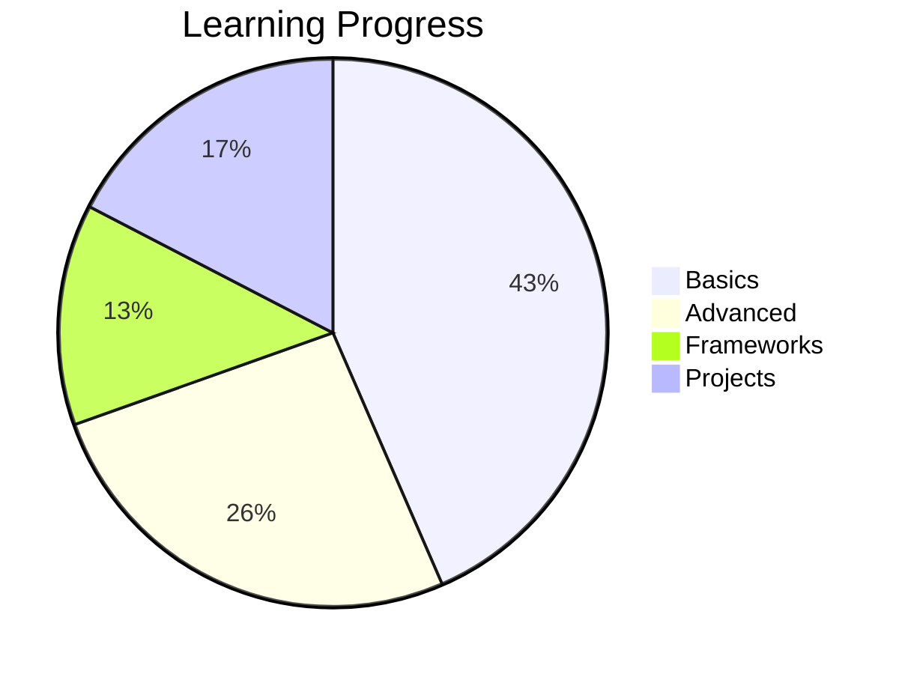
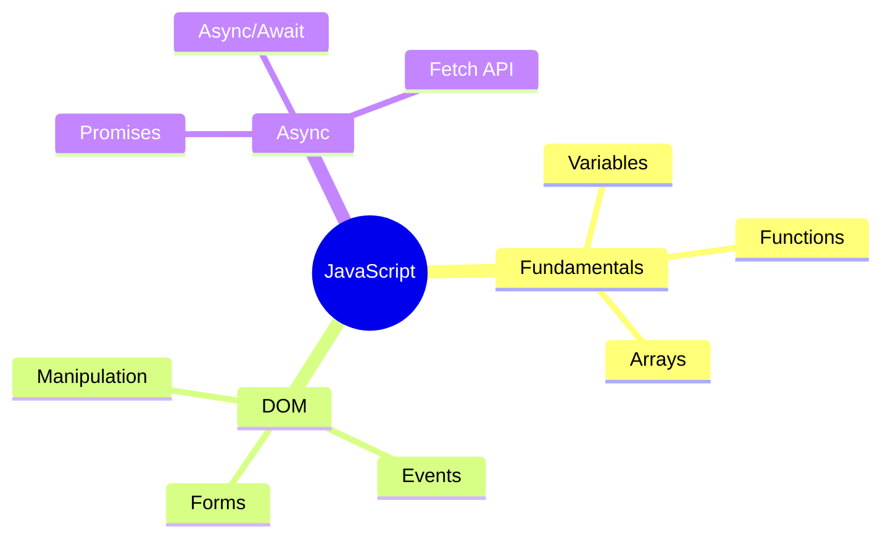
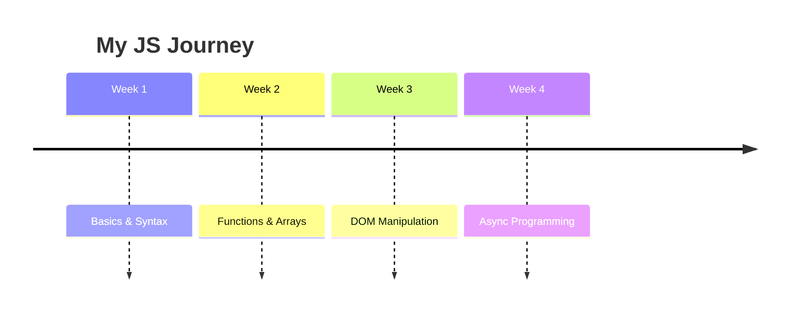

# Learning JavaScript

> [!info]
> Started: January 2024 | Status: 🔄 In Progress

## Progress Overview


## Concepts Mind Map


## Key Concepts

> [!tip] Variables
> JavaScript has three ways to declare variables:
> - `var` - function-scoped (avoid)
> - `let` - block-scoped
> - `const` - block-scoped, immutable

### Example Code
```javascript title="example.js" {3}
const name = "John";
let age = 25;
age = 26; // This works!
// name = "Jane"; // This would error!
```

## Learning Timeline


## Project Structure
```
my-project/
├── src/
│   ├── index.js
│   ├── utils/
│   │   └── helpers.js
│   └── components/
│       └── App.js
├── public/
└── package.json
```

## Math Concepts Used

The time complexity of binary search:

$$
O(\log n)
$$

## Resources

<details>
<summary>📚 Recommended Books</summary>

- Eloquent JavaScript
- You Don't Know JS
- JavaScript: The Good Parts

</details>

## Next Steps

- [ ] Complete async/await tutorial
- [ ] Build a weather app
- [ ] Learn about closures
- [x] Understand promises

---

**Related Notes:** [[Web Development]] | [[React Basics]] | [[Node.js]]