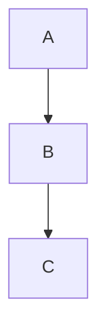
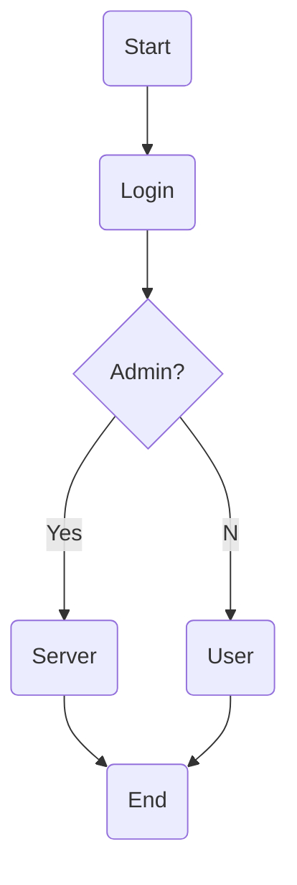
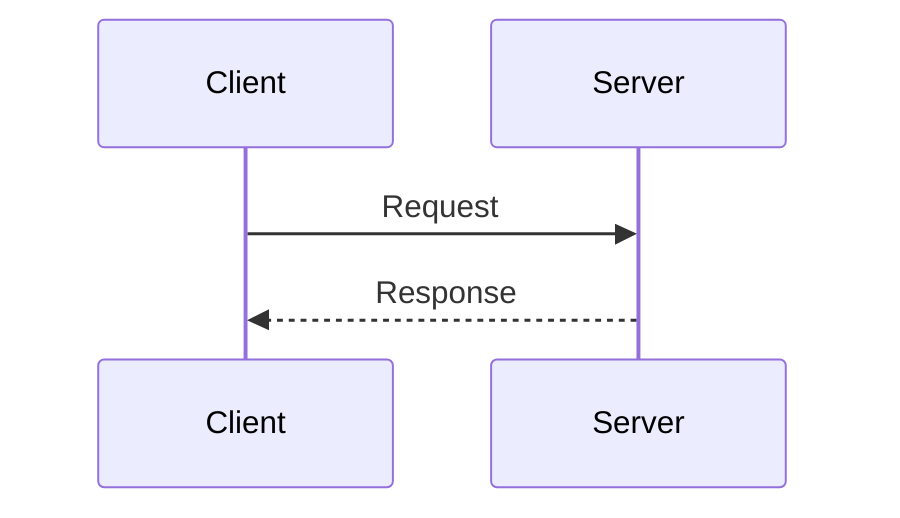
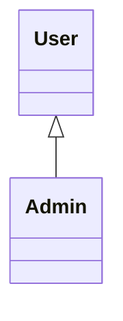
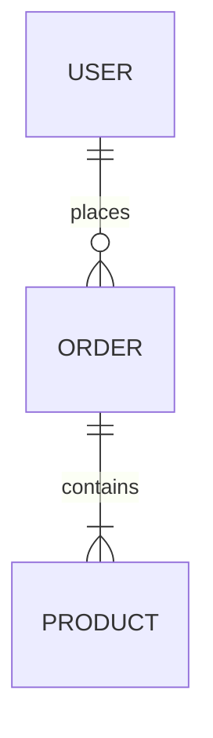
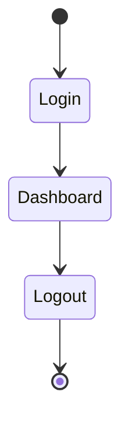
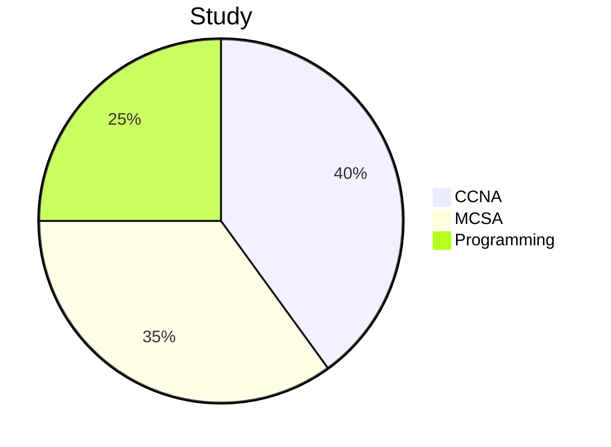
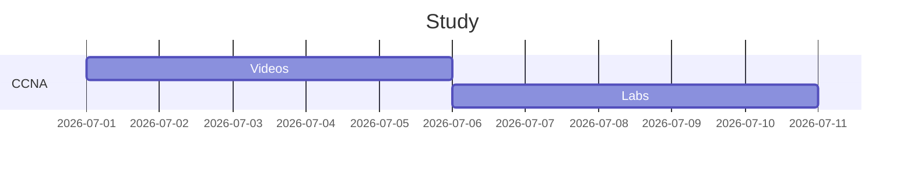

Absolutely. Since you use **Obsidian**, **Quartz 5**, **GitHub**, and write **MCSA notes**, here is an **Ultimate Markdown Cheat Sheet** that includes **CommonMark + GitHub Flavored Markdown (GFM) + Obsidian + Quartz-specific features** in one place. It covers the syntax most Markdown editors support, plus common extensions like tables, task lists, footnotes, and Mermaid diagrams. ([Markdific](https://markdific.com/resources/markdown-cheat-sheet/?utm_source=chatgpt.com "Markdown Cheat Sheet: Every Syntax with Examples (2026) | Markdific"))

---

# 📚 Ultimate Markdown Cheat Sheet

> **Works with**
> 
> - ✅ Obsidian
>     
> - ✅ Quartz
>     
> - ✅ GitHub
>     
> - ✅ VS Code
>     
> - ✅ Most Markdown editors
>     

---

# 1. Headings

```md
# Heading 1
## Heading 2
### Heading 3
#### Heading 4
##### Heading 5
###### Heading 6
```

Result

# Heading 1

## Heading 2

### Heading 3

---

# 2. Text Formatting

```md
**Bold**

*Italic*

***Bold Italic***

~~Strikethrough~~

`Inline Code`
```

Example

**Bold**

_Italic_

_**Bold Italic**_

~~Deleted~~

`code`

---

# 3. Quotes

```md
> Quote

>> Nested Quote
```

Result

> Quote

> > Nested Quote

---

# 4. Horizontal Line

```md
---

***

___
```

---

# 5. Lists

## Unordered

```md
- Item
- Item
  - Child
    - Child
```

Result

- Item
    
- Item
    
    - Child
        
        - Child
            

---

## Ordered

```md
1. First
2. Second
3. Third
```

---

## Mixed

```md
1. Windows
    - Server
    - Client

2. Linux
```

---

# 6. Task Lists

```md
- [ ] Not Done

- [x] Done
```

Result

-  Learn AD
    
-  Install Windows Server
    

---

# 7. Links

```md
[Google](https://google.com)

<https://google.com>
```

---

# 8. Images

```md

```

Local

```md
![[image.png]]
```

Folder

```md
![[Images/server.png]]
```

Resize (Obsidian)

```md
![[server.png|300]]
```

---

# 9. Code

Inline

```md
`ipconfig`
```

---

## Code Block

````md
```
Hello
```
````

---

## Syntax Highlighting

````md
```powershell
Get-Process
```
````

Supported

```
powershell
bash
cmd
python
c
cpp
csharp
java
json
yaml
xml
html
css
javascript
sql
```

---

# 10. Tables

```md
| Name | Age |
|------|----:|
| Ali | 20 |
| Sara | 21 |
```

|Name|Age|
|---|--:|
|Ali|20|
|Sara|21|

Alignment

```md
| Left | Center | Right |
|:-----|:------:|------:|
```

---

# 11. Escaping Characters

```md
\*

\#

\[

\`

\\
```

---

# 12. Checkboxes

```md
- [ ] Read
- [ ] Watch
- [x] Finished
```

---

# 13. Emoji

```md
:smile:

:rocket:

:fire:

:white_check_mark:
```

or

```
🚀

🔥

⭐

✅
```

---

# 14. Footnotes

```md
Windows Server[^1]

[^1]: Microsoft Operating System
```

---

# 15. Superscript

```md
X^2^
```

Obsidian

```
X²
```

---

# 16. Highlight

```md
==Important==
```

Result

==Important==

---

# 17. Comments

HTML

```html
<!-- Hidden -->
```

---

# 18. Keyboard Keys

```html
<kbd>Ctrl</kbd> + <kbd>C</kbd>
```

Result

Ctrl + C

---

# 19. HTML Inside Markdown

```html
<center>Hello</center>

<details>
<summary>Click</summary>

Hidden Text

</details>
```

---

# 20. Mermaid Diagrams

````md

````

Flowchart



---

## Sequence



---

## Class Diagram



---

## ER Diagram



---

## State Diagram



---

## Pie



---

## Gantt



---

# 21. Obsidian Wiki Links

```md
[[Page]]

[[Folder/Page]]

[[Page|Display Name]]
```

---

# 22. Block References

```md
Some text ^myblock
```

Reference

```md
![[Page#^myblock]]
```

---

# 23. Section Links

```md
[[Windows#Installation]]
```

---

# 24. Embed Note

```md
![[Windows]]
```

Section

```md
![[Windows#Installation]]
```

---

# 25. Callouts (Obsidian)

```md
> [!NOTE]
> Note
```

Available

```md
> [!NOTE]

> [!TIP]

> [!IMPORTANT]

> [!WARNING]

> [!CAUTION]

> [!INFO]

> [!SUCCESS]

> [!FAILURE]

> [!QUESTION]

> [!BUG]

> [!EXAMPLE]

> [!QUOTE]
```

---

# 26. Math (LaTeX)

Inline

```md
$E=mc^2$
```

Block

```md
$$
a^2+b^2=c^2
$$
```

---

# 27. Definition Lists _(supported by some renderers)_

```md
Windows

: Operating System

Linux

: Open Source
```

---

# 28. Automatic Table of Contents

GitHub

```md
## Table of Contents

- [Install](#install)

- [Usage](#usage)
```

---

# 29. Collapsible Section

```html
<details>

<summary>Click Me</summary>

Hidden Text

</details>
```

---

# 30. Badges

```md


```

---

# 31. Common Obsidian Embeds

Image

```md
![[image.png]]
```

PDF

```md
![[book.pdf]]
```

Video

```md
![[video.mp4]]
```

Audio

```md
![[audio.mp3]]
```

---

# 32. Admonition Nesting

```md
> [!TIP]
>
> > [!WARNING]
> >
> > Nested
```

---

# 33. HTML Colors

```html
<span style="color:red">Danger</span>
```

---

# 34. Line Break

New paragraph

```md
Hello

World
```

Single line break

```md
Hello␠␠

World
```

(two trailing spaces)

---

# 35. Common Keyboard Shortcuts (Obsidian)

|Shortcut|Action|
|---|---|
|Ctrl+B|Bold|
|Ctrl+I|Italic|
|Ctrl+K|Link|
|Ctrl+Shift+V|Paste without formatting|
|Ctrl+P|Command Palette|
|Ctrl+O|Quick Switcher|
|Ctrl+E|Reading/Edit Mode|
|Alt+Enter|New line without leaving list|
|Ctrl+/|Toggle comment (editor dependent)|

---

# 🚀 Obsidian Power Features

````md
[[Page]]

![[Page]]

[[Page#Heading]]

![[Page#Heading]]

[[Page#^Block]]

![[Page#^Block]]

![[image.png|400]]

==Highlight==

> [!TIP]

```mermaid

graph TD

A-->B

````

$$

E=mc^2

$$

```

---

# ⭐ Most Useful Markdown You Should Memorize

| Feature | Syntax |
|---------|--------|
| Heading | `#` |
| Bold | `**text**` |
| Italic | `*text*` |
| Code | `` `code` `` |
| Code Block | ```` ``` ```` |
| Link | `[text](url)` |
| Image | `` |
| Wiki Link | `[[Page]]` |
| Embed | `![[Page]]` |
| Table | `\| A \| B \|` |
| Task | `- [ ]` |
| Highlight | `==text==` |
| Callout | `> [!NOTE]` |
| Mermaid | ```` ```mermaid ```` |
| Math | `$...$` / `$$...$$` |
| Footnote | `[^1]` |
| Quote | `>` |
| Horizontal Rule | `---` |

This covers the core Markdown syntax plus the GitHub Flavored Markdown and Obsidian features most people use daily. Some features (such as highlights, wiki links, and callouts) are editor-specific and may not render everywhere. :contentReference[oaicite:1]{index=1}
```